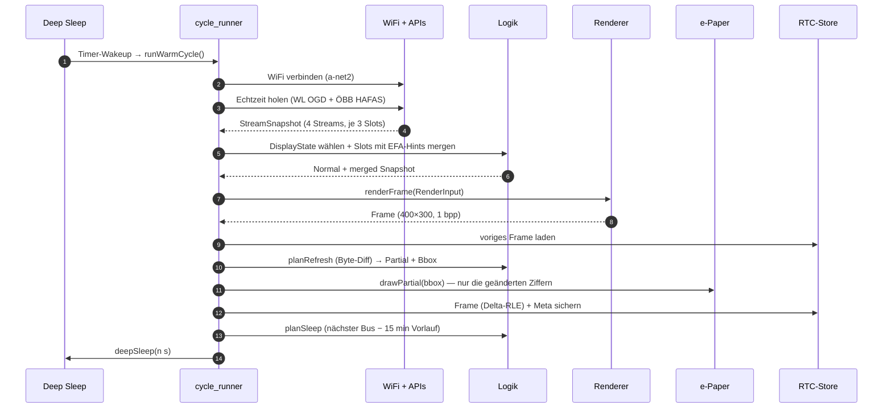
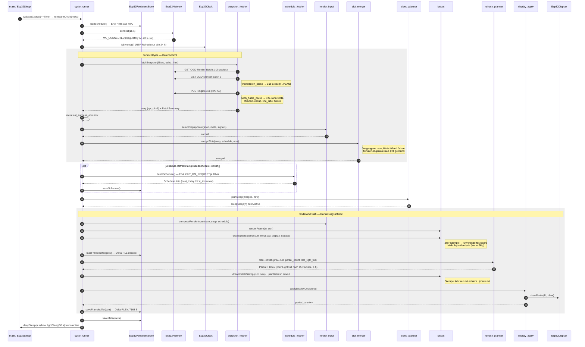
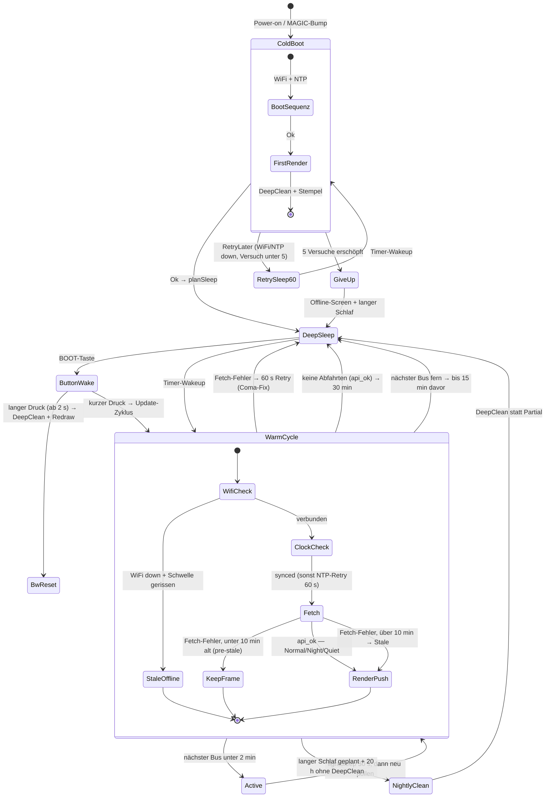
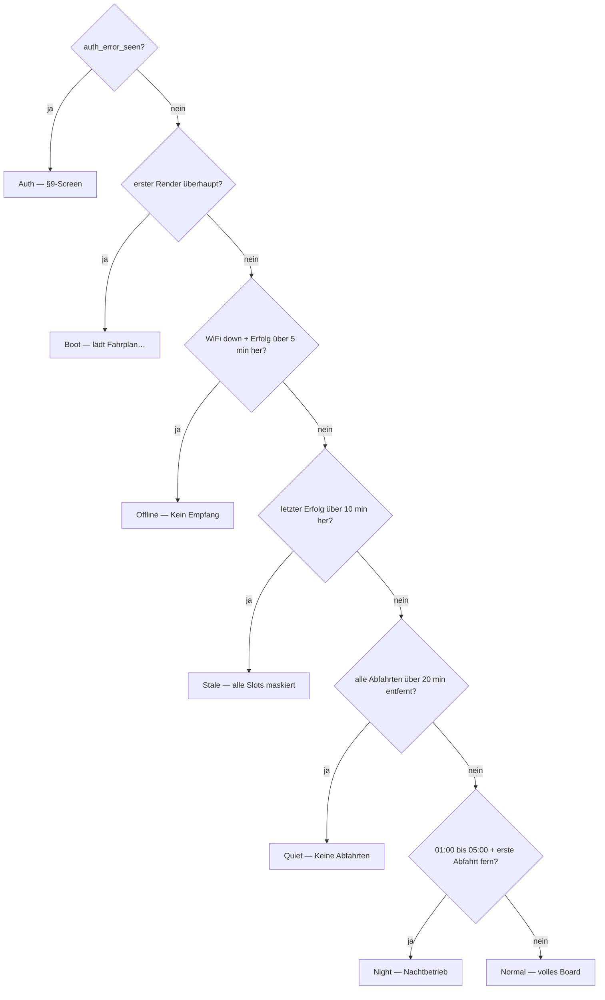

# Architektur

## Modulkarte

```text
src/
├── main.cpp                  Top-level setup()/loop(), Verdrahtung
├── config.h                  alle Schwellwerte und Pins (CONCEPT.md §10)
├── secrets.h                 (gitignored) WiFi-Credentials
│
├── hal/                      Hardware-Abstraktion
│   ├── IClock.h              Interface
│   ├── INetwork.h
│   ├── IDisplay.h
│   ├── ISleep.h
│   ├── IPersistentStore.h
│   └── Esp32*.{h,cpp}        ESP32-Implementierungen
│
├── data/                     plattformneutral, parsing/structs
│   ├── Departure.h
│   ├── StreamSnapshot.h
│   ├── PersistedMeta.h
│   ├── ScheduleHint.h
│   ├── wienerlinien_parse.{h,cpp}   OGD-JSON → bus-StreamData
│   ├── efa_parse.{h,cpp}            EFA-DM-Response → ScheduleHint
│   └── oebb_hafas_parse.{h,cpp}     mgate.exe-Antwort → S-Bahn-StreamData (v2)
│
├── logic/                    plattformneutral, reine Funktionen + kleine Klassen
│   ├── stale_policy.{h,cpp}         §4
│   ├── sleep_planner.{h,cpp}        §6
│   ├── refresh_planner.{h,cpp}      §5
│   ├── filter_health.{h,cpp}        §9
│   ├── boot_sequencer.{h,cpp}       §8
│   ├── filter_builder.{h,cpp}       Default-Filter-Set + `buildOebbFilter` (v2)
│   ├── api_fetcher.{h,cpp}          Retry-Wrapper um `httpGet` / `httpPost`
│   ├── snapshot_fetcher.{h,cpp}     pro Cycle: OGD-Batch + HAFAS-Call (v2)
│   ├── snapshot_logger.{h,cpp}      einheitliches `[snapshot]`-Log-Format
│   ├── schedule_fetcher.{h,cpp}     EFA-Endpoint → `ScheduleHint`
│   ├── schedule_refresh.{h,cpp}     entscheidet, ob EFA neu geladen wird
│   ├── slot_merger.{h,cpp}          Realtime ∪ `next_today` ∪ `first_tomorrow`
│   ├── render_input.{h,cpp}         Snapshot + `selectDisplayState` → `RenderInput`
│   ├── display_apply.{h,cpp}        Frame-Diff → `IDisplay::partial/full`
│   ├── button_classifier.{h,cpp}    Press-Klassifikation (Short / Long)
│   └── cycle_runner.{h,cpp}         `runColdCycle` / `runWarmCycle` — Engine
│
└── render/                   Layout und Rasterisierung
    ├── frame_buffer.h        Template FrameBuffer<W,H>, 1-bpp
    ├── canvas.{h,cpp}        Abstrakter Canvas + HostCanvas / AdafruitGfxCanvas (v2)
    ├── bitmap_fonts.{h,cpp}  Embedded VT323-Glyphen für die sieben Display-States (v2)
    ├── badge.{h,cpp}         Header-Badges (sm/md/lg) (v2)
    ├── plan_marker.{h,cpp}   5×5-Plan-Marker `□` (v2)
    ├── network_plan.{h,cpp}  Diamond/Big/Dot-Marker + Atzg-Linie (v2)
    ├── display_state.{h,cpp} Fullscreen-Renderer für Boot/Offline/Auth/Quiet (v2)
    ├── layout.{h,cpp}        Spalten-Layout für Normal/Stale/Night + `renderFrame`
    └── rle.{h,cpp}           Lauflängenkompression für RTC-RAM
```

## Schichten-Regel

```text
              main.cpp
                 │
        ┌────────┼────────┐
        ▼        ▼        ▼
       hal/    logic/   render/
        │        │        │
        │        ▼        │
        │      data/      │
        │        │        │
        └────────┴────────┘
                 ▼
               std::
```

- Pfeile nur nach unten (oder zur Seite)
- `logic/` und `data/` dürfen **keine** Hardware-Header inkludieren
- HAL-Implementierungen werden über Konstruktor-Injection an die Logik
  übergeben → Logik mit Mocks testbar

## Dataflow (Warm Cycle)

### Happy Case — Überblick

Ein Timer-Wakeup aus dem Deep Sleep, ein erfolgreicher Fetch, ein
Partial-Update, zurück in den Schlaf. Das ist der Zyklus, den das Gerät
tagsüber alle 30 s bis n Minuten fährt.



### Happy Case — Detail

Gleicher Zyklus, aufgelöst auf die realen Komponenten. Nummerierung folgt
`runWarmCycle()` in [cycle_runner.cpp](../src/logic/cycle_runner.cpp).



## Zustandsmaschine — Sonderfälle

Der Gerätelebenszyklus mit allen Fehler- und Randpfaden. Jede Kante, die
in `DeepSleep` mündet, trägt die Schlafdauer — genau diese Kanten
entscheiden, ob das Gerät "eingefroren" wirkt (siehe Coma-Fix in
[sleep_planner.cpp](../src/logic/sleep_planner.cpp): ein fehlgeschlagener
Fetch darf nie einen langen Schlaf planen).



Auf dem Panel entscheidet pro Zyklus der State-Selector, **welcher der
sieben Screens** gezeigt wird — eine Prioritätskette, kein Automat
(`selectDisplayState` in
[render_input.cpp](../src/logic/render_input.cpp), erste zutreffende
Bedingung gewinnt):



## Wichtige Design-Entscheidungen

### Framebuffer-Diff statt blind-redraw

e-Paper-Partials sind schnell und flickerfrei, kosten aber „Ghosting".
Wir behalten das letzte Bild im RTC-RAM (RLE-komprimiert, ~1–3 kB),
vergleichen byteweise, refreshen nur die Differenz-Bbox auf 8-Pixel-Grenzen.

### Light Full primär zeitgesteuert

Partial-Counter als reines Sicherheitsnetz: nach 2 h sowieso Light Full,
egal wie viele Partials. Vermeidet, dass bei statischen Anzeigen das
Ghosting unkontrolliert wächst.

### Cold-Boot-Erkennung via Wakeup-Cause

`esp_sleep_get_wakeup_cause() == ESP_SLEEP_WAKEUP_UNDEFINED` → frischer
Boot (Power-on oder Brown-out). Sonst → Wake aus Sleep, RTC-Daten gültig.

### Stale-Verhalten ist binär

Bewusste Vereinfachung: entweder vertrauenswürdige Echtzeit oder klar
sichtbares „kaputt". Keine grauen Zwischenzustände mit Zeitstempeln.

### Sieben Display-States statt Overlay-Bannern (v2)

Die alten v1-Banner (`VERALTET`, `Filter ungueltig`, `Start fehlgeschlagen`)
sind durch ein `DisplayState`-Enum mit sieben Werten ersetzt:

```text
                    SelectorSignals
                          │
                          ▼
         ┌──────────────────────────────────┐
         │     selectDisplayState()         │
         │     (logic/render_input.cpp)     │
         └────────────────┬─────────────────┘
                          │
        ┌─────┬─────┬─────┼─────┬─────┬─────┐
        ▼     ▼     ▼     ▼     ▼     ▼     ▼
      Boot  Normal Stale Night Quiet Offline Auth
```

`render/display_state.cpp` rendert für jeden State entweder den
Spalten-Board (`Normal`/`Stale`/`Night`) oder ein dediziertes
Fullscreen-Bild (`Boot`/`Quiet`/`Offline`/`Auth`). Die State-Auswahl
ist pure Funktion → vollständig host-testbar in `test_native_render_input`.

### `towards`-Filter-Drift wird sichtbar gemacht

Wenn 58B im Endemann-RBL 3 erfolgreiche API-Calls in Folge keinerlei
Departure mit passendem `towards` liefert, blendet das Bustaferl
`58B Filter ungueltig` ein. Sonst würde der Wegfall stillschweigend zu
`--:--` werden und ewig so bleiben.

## Wo welche Konstante wirkt

| Konstante                  | Modul                         | Effekt                              |
|----------------------------|-------------------------------|-------------------------------------|
| `STALE_THRESHOLD_S`        | logic/stale_policy            | Sekunden bis Banner „veraltet"      |
| `OFFLINE_THRESHOLD_S`      | logic/render_input            | Wechsel `Normal` → `Offline` (v2)   |
| `QUIET_HORIZON_S`          | logic/render_input            | Schwelle für `Quiet`-State (v2)     |
| `WAKE_BEFORE_BUS_S`        | logic/sleep_planner           | Vorlauf vor frühster Abfahrt        |
| `BOOT_MARGIN_S`            | logic/sleep_planner           | Boot+WiFi+API-Reserve               |
| `POLL_INTERVAL_S`          | logic/cycle_runner            | Poll-Cadence im Wach-Zustand        |
| `ACTIVE_THRESHOLD_S`       | logic/sleep_planner           | Schwelle DeepSleep vs. Active       |
| `NO_DATA_SLEEP_S`          | logic/sleep_planner           | Sleep wenn API leer                 |
| `PARTIAL_HARDCAP`          | logic/refresh_planner         | erzwungenes Light Full bei Cap      |
| `LIGHT_FULL_INTERVAL_S`    | logic/refresh_planner         | Light Full alle 2 h                 |
| `NTP_INTERVAL_S`           | logic/cycle_runner            | NTP-Resync täglich                  |
| `FILTER_HEALTH_DEAD_AFTER` | logic/filter_health           | Misses bis „Filter ungültig"        |
| `OGD_AUTH_STREAK_TRIPWIRE` | logic/snapshot_fetcher        | 3× OGD-401 → `auth_error_seen` (v2) |
| `OEBB_EXTID_ATZG/_WIENHBF` | data/oebb_hafas_parse + cfg   | HAFAS-`stbLoc`/`dirLoc` (v2)        |
| `OEBB_HAFAS_AID`           | config.h → mgate.exe-Body     | HAFAS-Auth-Token (rotiert) (v2)     |
| `RLE_HARDCAP_BYTES`        | hal/Esp32PersistentStore      | maximaler RLE-Buffer im RTC-RAM     |

## Speicher-Layout (ESP32)

- **Flash:** Firmware (~600 kB) + Arduino + GxEPD2 + ArduinoJson + embedded
  Bitmap-Fonts (~20–80 kB für die VT323-Glyphen aus `render/bitmap_fonts`)
- **DRAM:** zwei Framebuffer à 15 kB (`g_frame_new`, `g_frame_prev`) + Stack + Heap
- **RTC slow memory (8 kB):** `PersistedMeta` (inkl. `Departure::line_label`
  pro Slot, +48 B v2) + RLE-Framebuffer (Budget 3 kB, Hardcap 7 kB)
- **RTC fast memory:** ungenutzt

## Host-Engine (`test/test_native_runtime/`)

Die `runColdCycle` / `runWarmCycle`-Engine aus `logic/cycle_runner` läuft auch
auf dem Host. `test/test_native_runtime/` ist ein Standalone-Treiber, der die
Engine gegen die echten Wiener-Linien-Endpoints fährt — kein PIO-Test-Bucket,
sondern ein direktes `g++`-Target via `make native-runtime-*`.

| Adapter                              | Ersetzt …            | Verhalten                                                                 |
|--------------------------------------|----------------------|---------------------------------------------------------------------------|
| `WallClockClock`                     | `Esp32Clock`         | `time(nullptr)` + `gmtime_r`; `isSynced()` immer `true`                   |
| `HttpsNet` (libcurl)                 | `Esp32Network`       | HTTPS-GET gegen den realen Endpoint; ENV-Overrides für Base + TLS-Verify  |
| `DiskStore`                          | `Esp32PersistentStore` | `PersistedMeta` + RLE-Frame + `ScheduleSnapshot` in `persist.bin`        |
| `NoOpDisplay`                        | `Esp32Display`       | verschluckt `partial/full/clear`; kein Panel                              |
| `NoOpSleep`                          | `Esp32Sleep`         | `deepSleep` kehrt zurück (ein Prozess, valgrind sieht alle Cycles)        |
| `RecordingRenderer`                  | `Esp32Renderer`      | 1bpp-Pseudo-Raster + Dedup; schreibt P5-PGM pro Frame-Wechsel             |

Der Treiber existiert für drei Klassen, die `test_native_*` mit Fake-INetwork
nicht abdeckt: HTTPS-Edge-Cases gegen den Live-Endpoint, EFA-Mapping mit
realen Responses, und Heap-Verlauf über N Cycles in einem Prozess
(`make native-runtime-smoke` → valgrind). Details in
[../test/test_native_runtime/README.md](../test/test_native_runtime/README.md).
