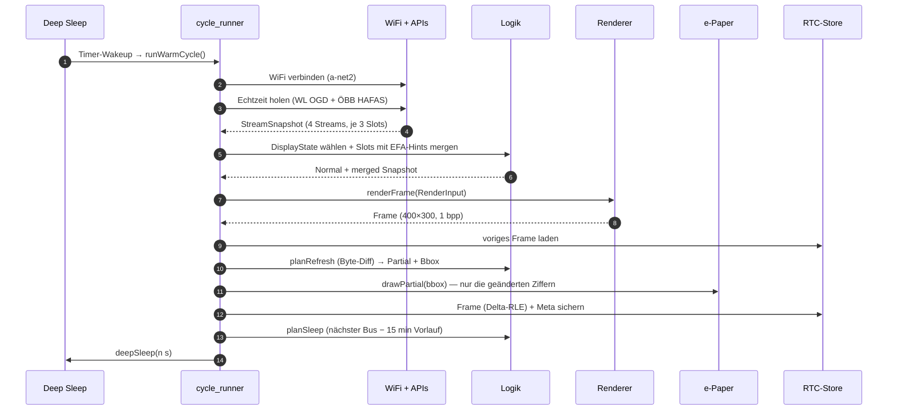
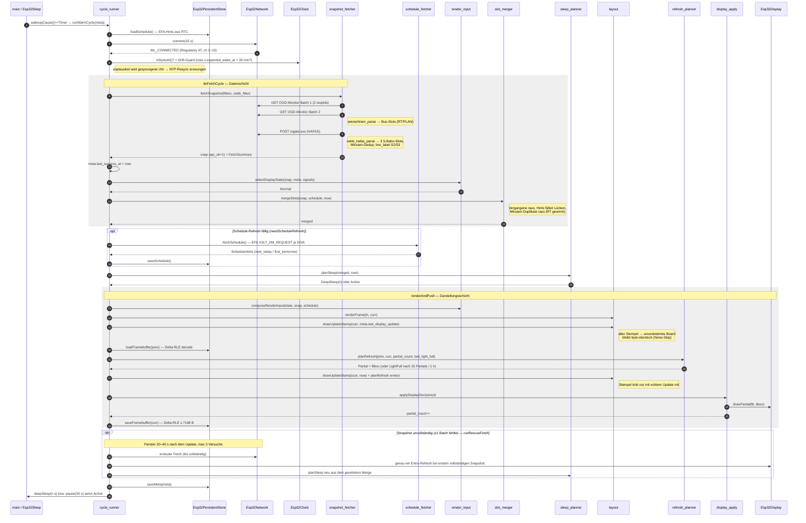
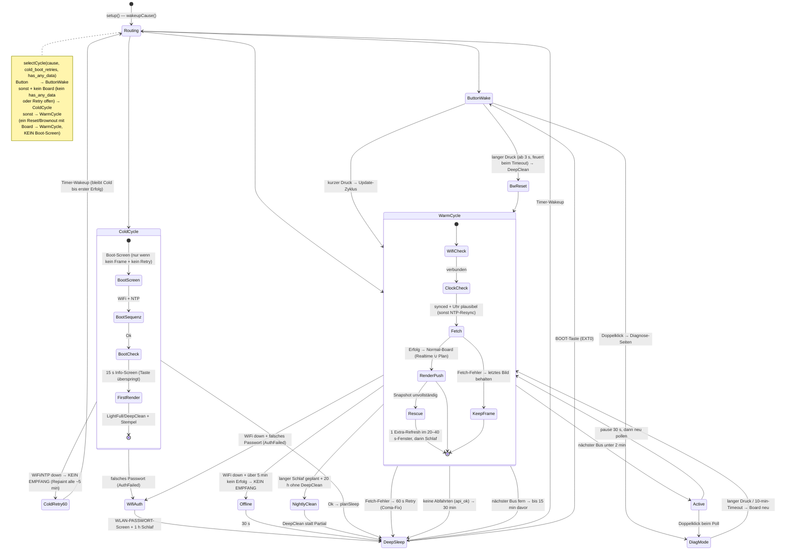
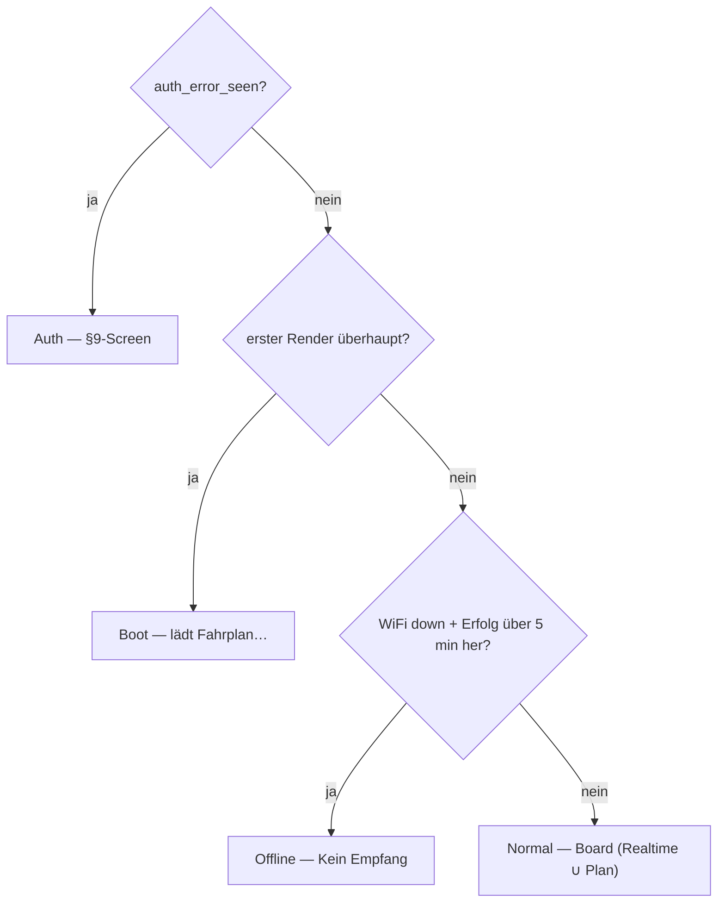

# Architektur

## Modulkarte

```text
src/
├── main.cpp                  Top-level setup()/loop(), Verdrahtung
├── config.h                  alle Schwellwerte und Pins (CONCEPT.md §10)
├── secrets.h                 (gitignored) WiFi-Credentials
│
├── hal/                      Hardware-Abstraktion
│   ├── IClock.h              Interface
│   ├── INetwork.h            + `connectionInfo()` (SSID/IP/RSSI für Diagnose)
│   ├── NetInfo.h             Leaf-Struct: WLAN-Assoziationsdetails
│   ├── IDisplay.h
│   ├── ISleep.h
│   ├── IButton.h             Boot-Taster (isPressed / nowMs / sleepMs)
│   ├── IPersistentStore.h    + `loadTrace()` / `saveTrace()` (CycleTrace)
│   └── Esp32*.{h,cpp}        ESP32-Implementierungen
│
├── data/                     plattformneutral, parsing/structs
│   ├── Departure.h
│   ├── StreamSnapshot.h
│   ├── ScheduleHint.h
│   ├── CycleTrace.h          RTC-Ringpuffer: Zyklus- + Fehler-Historie
│   ├── DiagView.h            transientes Bündel für Diagnose-/Boot-Check-Seiten
│   ├── wienerlinien_parse.{h,cpp}   OGD-JSON → bus-StreamData
│   ├── efa_parse.{h,cpp}            EFA-DM-Response → ScheduleHint
│   └── oebb_hafas_parse.{h,cpp}     mgate.exe-Antwort → S-Bahn-StreamData
│
├── logic/                    plattformneutral, reine Funktionen + kleine Klassen
│   ├── stale_policy.{h,cpp}         `isStale` — Legacy, produktiv ungenutzt
│   ├── sleep_planner.{h,cpp}        §6
│   ├── refresh_planner.{h,cpp}      §5
│   ├── filter_health.{h,cpp}        §9
│   ├── boot_sequencer.{h,cpp}       §8
│   ├── filter_builder.{h,cpp}       Default-Filter-Set + `buildOebbFilter`
│   ├── api_fetcher.{h,cpp}          Retry-Wrapper um `httpGet` / `httpPost`
│   ├── rescue_policy.{h,cpp}        Rescue-Fetch-Fenster (§6): Nachhol-Logik
│   ├── snapshot_fetcher.{h,cpp}     pro Cycle: OGD-Batch + HAFAS-Call
│   ├── snapshot_logger.{h,cpp}      einheitliches `[snapshot]`-Log-Format
│   ├── schedule_fetcher.{h,cpp}     EFA-Endpoint → `ScheduleHint`
│   ├── schedule_refresh.{h,cpp}     entscheidet, ob EFA neu geladen wird
│   ├── slot_merger.{h,cpp}          Realtime ∪ `next_today` ∪ `first_tomorrow`
│   ├── render_input.{h,cpp}         Snapshot + `selectDisplayState` → `RenderInput`
│   ├── display_apply.{h,cpp}        Frame-Diff → `IDisplay::partial/full`
│   ├── button_classifier.{h,cpp}    Press-Klassifikation (Short / Long / Double)
│   ├── cycle_trace.{h,cpp}          Ring-Push/-Zugriff auf CycleTrace (pure)
│   ├── diag_mode.{h,cpp}            Pager-Automat (diagNext) für Diagnose-Seiten
│   └── cycle_runner.{h,cpp}         `runColdCycle` / `runWarmCycle` / `runDiagMode` — Engine
│
└── render/                   Layout und Rasterisierung
    ├── frame_buffer.h        Template FrameBuffer<W,H>, 1-bpp
    ├── canvas.{h,cpp}        Abstrakter Canvas + HostCanvas / AdafruitGfxCanvas
    ├── bitmap_fonts.{h,cpp}  U8g2-Font-Roles für Board + Fullscreen-States
    ├── badge.{h,cpp}         Header-Badges (sm/md/lg)
    ├── plan_marker.{h,cpp}   5×5-Plan-Marker `□`
    ├── deviation_gauge.{h,cpp} 58A Live-vs-Fahrplan-Abweichungsanzeige
    ├── network_plan.{h,cpp}  Diamond/Big/Dot-Marker + Atzg-Linie
    ├── display_state.{h,cpp} Fullscreen-Renderer für Boot/Offline/Auth/WifiAuth
    ├── diag_page.{h,cpp}     Text-Renderer der Diagnose-Seiten + Boot-Check
    ├── layout.{h,cpp}        Spalten-Board (`Normal`) + `renderFrame`
    └── rle.{h,cpp}           Lauflängenkompression für RTC-RAM
```

## Schichten-Regel

```text
              main.cpp
                 │
        ┌────────┼────────┐
        ▼        ▼        ▼
       hal/    logic/   render/
        │        │        │
        │        ▼        │
        │      data/      │
        │        │        │
        └────────┴────────┘
                 ▼
               std::
```

- Pfeile nur nach unten (oder zur Seite)
- `logic/` und `data/` dürfen **keine** Hardware-Header inkludieren
- HAL-Implementierungen werden über Konstruktor-Injection an die Logik
  übergeben → Logik mit Mocks testbar

## Dataflow (Warm Cycle)

### Happy Case — Überblick

Ein Timer-Wakeup aus dem Deep Sleep, ein erfolgreicher Fetch, ein
Partial-Update, zurück in den Schlaf. Das ist der Zyklus, den das Gerät
tagsüber alle 30 s bis n Minuten fährt.



### Happy Case — Detail

Gleicher Zyklus, aufgelöst auf die realen Komponenten. Nummerierung folgt
`runWarmCycle()` in [cycle_runner.cpp](../src/logic/cycle_runner.cpp).



## Zustandsmaschine — Sonderfälle

Der Gerätelebenszyklus mit allen Fehler- und Randpfaden. Jede Kante, die
in `DeepSleep` mündet, trägt die Schlafdauer — genau diese Kanten
entscheiden, ob das Gerät "eingefroren" wirkt (siehe Coma-Fix in
[sleep_planner.cpp](../src/logic/sleep_planner.cpp): ein fehlgeschlagener
Fetch darf nie einen langen Schlaf planen).



Auf dem Panel entscheidet pro Zyklus der State-Selector, **welcher Screen**
gezeigt wird — eine kurze Prioritätskette, kein Automat (`selectDisplayState`
in [render_input.cpp](../src/logic/render_input.cpp), erste zutreffende
Bedingung gewinnt). Nur die Fehler-/Platzhalter-Screens sind eigene States;
alles mit Daten ist das **Normal**-Board, dessen Inhalt die Daten bestimmen
(frisch, nur-Plan, veraltet oder eine ruhige Lücke rendern dasselbe Board):



Kein separater Stale-/Quiet-/Night-Screen: die nächste Abfahrt (Echtzeit oder
Plan) wird immer mit ihrer echten Uhrzeit gezeigt — auch wenn sie Stunden
entfernt liegt. Nur wenn ein Slot weder aus Echtzeit noch aus dem Fahrplan
gefüllt werden kann, steht dort `--:--`. Der terminale `WifiAuth`-Screen
(falsches WLAN-Passwort) wird nicht hier, sondern direkt im `cycle_runner`
gewählt.

## Wichtige Design-Entscheidungen

### Framebuffer-Diff statt blind-redraw

e-Paper-Partials sind schnell und flickerfrei, kosten aber „Ghosting".
Wir behalten das letzte Bild im RTC-RAM (RLE-komprimiert, ~1–3 kB),
vergleichen byteweise, refreshen nur die Differenz-Bbox auf 8-Pixel-Grenzen.

### Light Full gegen Ghosting

Ein Light Full Refresh (1× S/W-Flash + Bild) läuft, sobald der letzte
mindestens `LIGHT_FULL_INTERVAL_S` (1 h) her ist **oder** seither
`PARTIAL_HARDCAP` (15) Partials liefen — je nachdem, was zuerst eintritt.
Beides zusammen hält das Ghosting bei statischen wie bei sich häufig
ändernden Anzeigen in Schach.

### Cold-Boot-Erkennung via Wakeup-Cause

`esp_sleep_get_wakeup_cause() == ESP_SLEEP_WAKEUP_UNDEFINED` → frischer
Boot (Power-on oder Brown-out). Sonst → Wake aus Sleep, RTC-Daten gültig.

### Deep-Wake erzwingt Full Refresh

Ein Wake aus Deep Sleep verliert den schnellen Partial-RAM des Panels. Der
erste Render danach wird deshalb auf einen Full Refresh promotet
(`deep_wake` → `planRefresh(panel_ram_untrusted)`), sonst zeigen sich weiße
Ränder und Garbage. Nur der allererste Render pro Wake ist betroffen.

### Drift-Guard gegen korrupte RTC-Uhr

`isSynced()` erzwingt nur eine untere Zeitschranke (> 2023). Weckt das Gerät
mit einer `now()`, die mehr als `MAX_WAKE_OVERSHOOT_S` (30 min) über dem beim
Einschlafen gespeicherten `expected_wake_at` liegt, gilt die Uhr als korrupt
und ein NTP-Resync läuft vor dem Rendern — sonst würden Plan-Hints gegen eine
um Stunden versetzte Uhr gerendert (Feld-Symptom „58B-Coma").

### Immer die nächste Abfahrt zeigen

Bewusste Vereinfachung: Es gibt keinen Blank-Screen für „keine Abfahrten
bald" und keinen maskierten `??:??`-Screen für veraltete Daten. Solange
irgendeine Abfahrt bekannt ist (Echtzeit **oder** Plan), zeigt das Board sie
mit ihrer echten Uhrzeit — auch vier Stunden im Voraus. Fällt ein Fetch aus,
behält der Warm-Zyklus das letzte gute Bild, statt auf `--:--` zu blanken.

### Wenige Display-States

Das `DisplayState`-Enum hat nur noch fünf Werte — die Fehler-/Platzhalter-
Screens plus das Board:

```text
                    SelectorSignals
                          │
                          ▼
         ┌──────────────────────────────────┐
         │     selectDisplayState()         │
         │     (logic/render_input.cpp)     │
         └────────────────┬─────────────────┘
                          │
        ┌─────────┬───────┼────────┬─────────┐
        ▼         ▼       ▼        ▼         ▼
      Boot     Normal  Offline   Auth    WifiAuth
```

`render/display_state.cpp` rendert die vier Fullscreen-Bilder
(`Boot`/`Offline`/`Auth`/`WifiAuth`); `render/layout.cpp` rendert das
`Normal`-Board, dessen Datenlage (nur Echtzeit, nur Plan, gemischt, leer)
das Bild bestimmt. Die frühere `Stale`/`Quiet`/`Night`-Trias wurde entfernt —
sie verwarf echte Abfahrtszeiten für einen blanken oder redundanten Screen.
Die State-Auswahl ist pure Funktion → host-testbar in
`test_native_render_input`.

### `towards`-Filter-Drift wird mitgezählt

Wenn 58B im Endemann-RBL mehrere erfolgreiche API-Calls in Folge keinerlei
Departure mit passendem `towards` liefert, führt `FilterHealth` einen
Streak-Zähler mit (`filter_miss_streak` in `PersistedMeta`). Er hat keinen
eigenen Screen mehr, ist aber im Diagnose-Modus (STATUS-Seite) und in der
Fehler-Historie ablesbar — so bleibt ein stiller Filter-Ausfall
diagnostizierbar, statt einfach ewig `--:--` zu zeigen.

### Diagnose-Modus statt serieller Logs

Das Gerät hängt im Betrieb an keiner seriellen Konsole. Um eine im Feld
beobachtete Anomalie („warum stand da `--:--`?") ohne Log verstehen zu können,
führt jeder Warm-Zyklus einen kompakten **CycleTrace** mit: pro Zyklus ein
12-B-`CycleRecord` (Zeit, Auslöser, Stream-OK-Bits, fehlgeschlagene Batches,
Rescue-Flags, Schlafdauer) plus 6-B-`ErrorRecord`s für Anomalien — zwei
RTC-Ringpuffer (je 16 Einträge, ~292 B), die den Tiefschlaf überstehen.

Ein **Doppelklick** öffnet `runDiagMode`: einmal frisch fetchen, dann vier
schlichte Text-Seiten (STATUS / ZYKLEN / FEHLER / DATEN-DETAILS), vorwärts per
Kurzdruck (mit Umlauf), zurück per Langdruck, Sicherheits-Timeout nach 10 min.
Die Aufteilung ist bewusst geschichtet: `logic/cycle_trace` (Ring, pure),
`logic/diag_mode` (`diagNext`-Pager-Automat, pure) und `render/diag_page`
(Text auf abstraktem `render::Canvas`) sind alle host-testbar; `cycle_runner`
verdrahtet nur Fetch, HAL-Probe (`connectionInfo`, Heap/Uptime) und den
Button-Loop.

### Boot-Check nach dem Kaltstart

Nach erfolgreicher Boot-Sequenz zeigt `runColdCycle` für `BOOT_INFO_SHOW_S`
(15 s, per Taste überspringbar) denselben STATUS-Screen plus Start-Zeilen
(RTC-Restore-Status, Batch-Tally, WLAN&NTP-Anlauf) — ein Selbsttest, den man
direkt nach dem Einschalten lesen kann. Erst danach rendert das Board. Weil der
Boot-Check bereits deep-cleant, genügt dem Board danach ein Light-Full.

## Wo welche Konstante wirkt

| Konstante                  | Wert | Modul                         | Effekt                              |
|----------------------------|------|-------------------------------|-------------------------------------|
| `STALE_THRESHOLD_V2_S`     | 600  | logic/cycle_runner            | Redraw-Guard-Fenster: Fetch-Fehler älter → Board neu statt letztes Bild |
| `OFFLINE_THRESHOLD_S`      | 300  | logic/render_input            | WiFi down + Schwelle → `Offline`    |
| `WAKE_BEFORE_BUS_S`        | 900  | logic/sleep_planner           | Vorlauf vor frühster Abfahrt        |
| `BOOT_MARGIN_S`            | 30   | logic/sleep_planner           | Boot+WiFi+API-Reserve               |
| `POLL_INTERVAL_S`          | 30   | logic/cycle_runner            | Poll-Cadence im Wach-Zustand        |
| `ACTIVE_THRESHOLD_S`       | 120  | logic/sleep_planner           | Schwelle DeepSleep vs. Active       |
| `NO_DATA_SLEEP_S`          | 1800 | logic/sleep_planner           | Sleep wenn API leer (aber `api_ok`) |
| `API_FAILURE_RETRY_S`      | 60   | logic/sleep_planner           | Kurz-Retry nach fehlgeschlagenem Fetch (Coma-Fix) |
| `PARTIAL_HARDCAP`          | 15   | logic/refresh_planner         | erzwungenes Light Full nach N Partials |
| `LIGHT_FULL_INTERVAL_S`    | 3600 | logic/refresh_planner         | Light Full spätestens alle 1 h      |
| `RESCUE_WINDOW_START/END_S` | 20/40 | logic/rescue_policy          | Nachhol-Fenster nach unvollständigem Fetch |
| `RESCUE_MAX_ATTEMPTS`      | 3    | logic/rescue_policy           | max. Komplett-Fetches im Rescue-Fenster |
| `NTP_INTERVAL_S`           | 86400 | logic/cycle_runner           | NTP-Resync täglich                  |
| `BTN_LONG_PRESS_MS`        | 3000 | logic/button_classifier       | Halten bis Long → S/W-Reset         |
| `BTN_DOUBLE_CLICK_MS`      | 400  | logic/button_classifier       | Fenster für Doppelklick → Diagnose  |
| `DIAG_MAX_S`               | 600  | logic/cycle_runner            | Sicherheits-Timeout des Diagnose-Modus |
| `BOOT_INFO_SHOW_S`         | 15   | logic/cycle_runner            | Dauer des Boot-Check-Screens (0 = aus) |
| `MAX_WAKE_OVERSHOOT_S`     | 1800 | logic/cycle_runner            | Wake über `expected_wake_at` hinaus → Drift-Guard erzwingt NTP |
| `FILTER_HEALTH_DEAD_AFTER` | 3    | logic/filter_health           | Misses bis „Filter ungültig"        |
| `OGD_AUTH_STREAK_TRIPWIRE` | 3    | logic/snapshot_fetcher        | 3× OGD-401 → `auth_error_seen`      |
| `OEBB_EXTID_ATZG/_WIENHBF` | —    | data/oebb_hafas_parse + cfg   | HAFAS-`stbLoc`/`dirLoc`             |
| `OEBB_HAFAS_AID`           | —    | config.h → mgate.exe-Body     | HAFAS-Auth-Token (rotiert)          |
| `RLE_HARDCAP_BYTES`        | 7168 | hal/Esp32PersistentStore      | maximaler RLE-Buffer im RTC-RAM     |

## Speicher-Layout (ESP32)

- **Flash:** Firmware gesamt ~1,08 MB (~83 % der 1,31-MB-App-Partition):
  eigener Code + Arduino + GxEPD2 + ArduinoJson + U8g2-Font-Daten (7
  Font-Roles aus `render/bitmap_fonts`) + Custom-Glyphen
- **DRAM:** zwei Framebuffer à 15 kB (`g_frame_new`, `g_frame_prev`) + Stack + Heap
- **RTC slow memory (8 kB):** `PersistedMeta` + `StreamSnapshot` (inkl.
  `Departure::line_label` pro Slot) + `ScheduleHint` + `CycleTrace`
  (Zyklus-/Fehler-Historie, ~292 B) + RLE-Framebuffer
  (Budget ~3 kB, Hardcap `RLE_HARDCAP_BYTES` = 7168 B) — Bilanz in
  [rtc-memory-budget.md](rtc-memory-budget.md)
- **RTC fast memory:** ungenutzt

## Host-Engine (`test/test_native_runtime/`)

Die `runColdCycle` / `runWarmCycle`-Engine aus `logic/cycle_runner` läuft auch
auf dem Host. `test/test_native_runtime/` ist ein Standalone-Treiber, der die
Engine gegen die echten Wiener-Linien-Endpoints fährt — kein PIO-Test-Bucket,
sondern ein direktes `g++`-Target via `make native-runtime-*`.

| Adapter                              | Ersetzt …            | Verhalten                                                                 |
|--------------------------------------|----------------------|---------------------------------------------------------------------------|
| `WallClockClock`                     | `Esp32Clock`         | `time(nullptr)` + `gmtime_r`; `isSynced()` immer `true`                   |
| `HttpsNet` (libcurl)                 | `Esp32Network`       | HTTPS-GET gegen den realen Endpoint; ENV-Overrides für Base + TLS-Verify  |
| `DiskStore`                          | `Esp32PersistentStore` | `PersistedMeta` + RLE-Frame + `ScheduleSnapshot` in `persist.bin`        |
| `NoOpDisplay`                        | `Esp32Display`       | verschluckt `partial/full/clear`; kein Panel                              |
| `NoOpSleep`                          | `Esp32Sleep`         | `deepSleep` kehrt zurück (ein Prozess, valgrind sieht alle Cycles)        |
| `RecordingRenderer`                  | `Esp32Renderer`      | 1bpp-Pseudo-Raster + Dedup; schreibt P5-PGM pro Frame-Wechsel             |

Der Treiber existiert für drei Klassen, die `test_native_*` mit Fake-INetwork
nicht abdeckt: HTTPS-Edge-Cases gegen den Live-Endpoint, EFA-Mapping mit
realen Responses, und Heap-Verlauf über N Cycles in einem Prozess
(`make native-runtime-smoke` → valgrind). Details in
[../test/test_native_runtime/README.md](../test/test_native_runtime/README.md).
