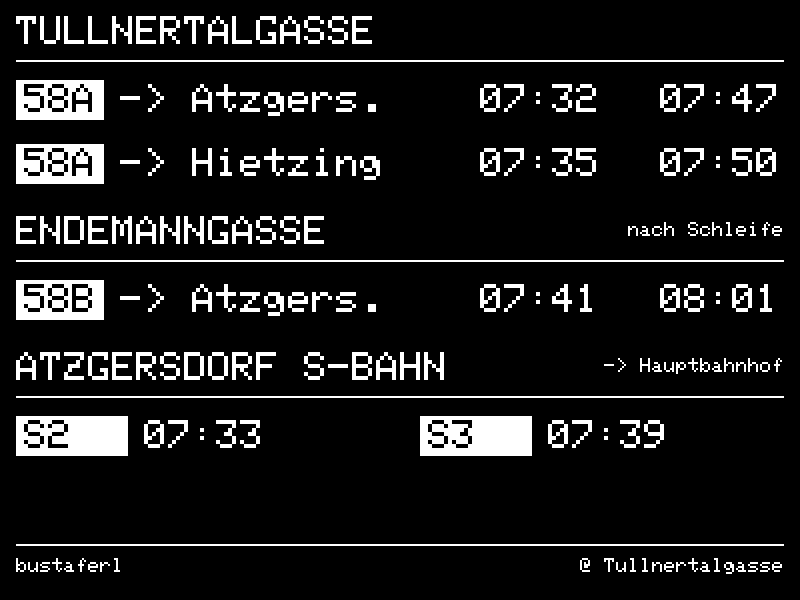
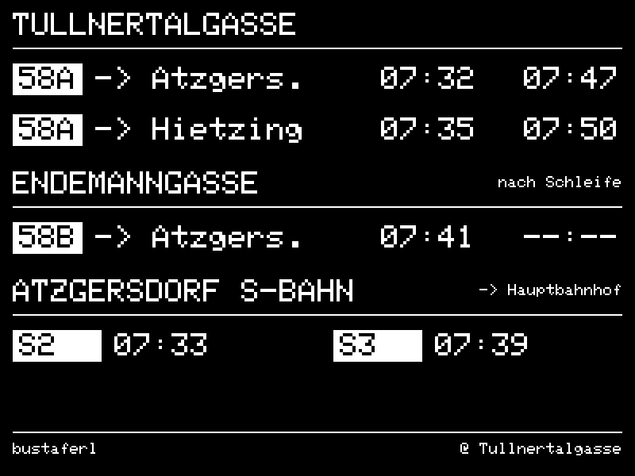
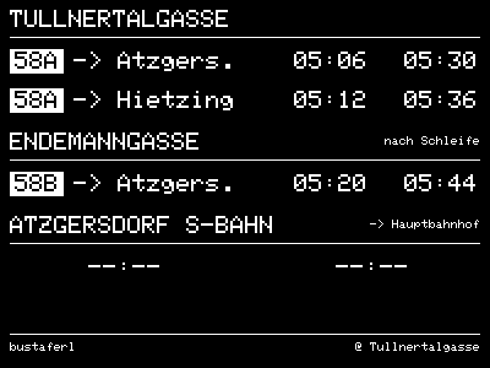
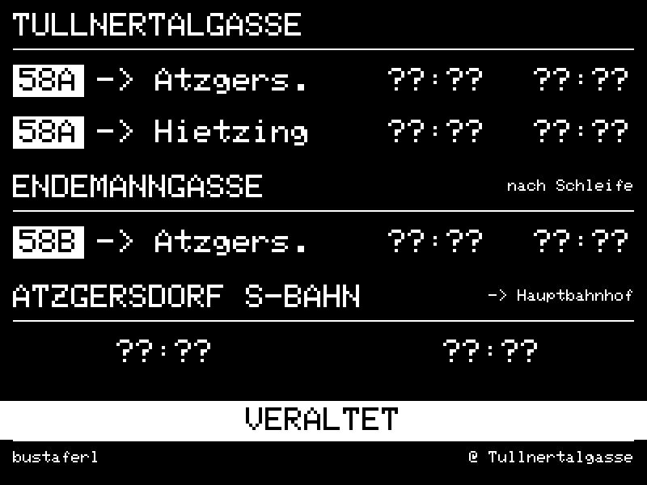
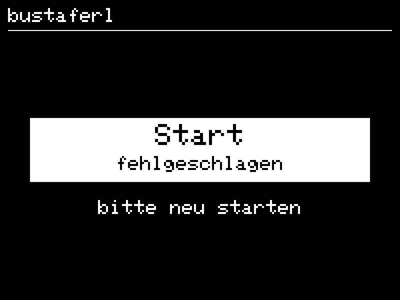
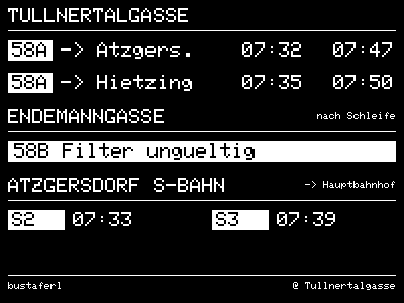
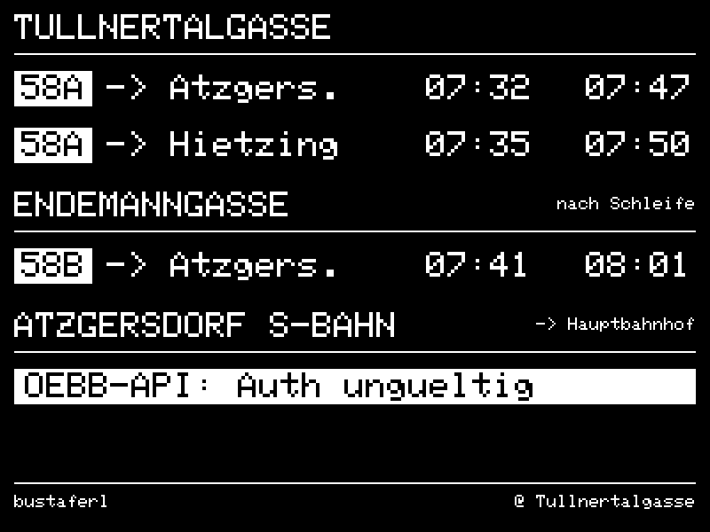
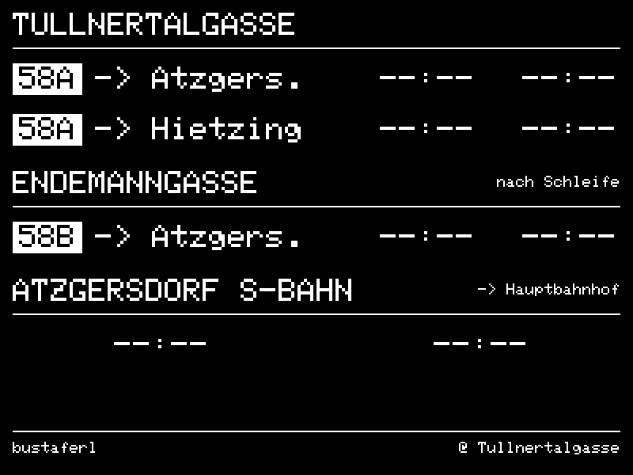

# Benutzerhandbuch

Das Bustaferl ist eine e-Paper-Anzeige fürs Vorzimmer. Es zeigt rohe
Echtzeit-Abfahrten — kein „Du musst jetzt los", keine Countdowns, keine
Bewertung. Die Entscheidung „aufbrechen oder warten" trifft der Mensch
selbst anhand bekannter Gehzeiten.

Dieses Handbuch erklärt, **was auf dem Display zu sehen ist** und **was es
bedeutet**. Inbetriebnahme, Verkabelung und Konfiguration findest du in
[USER.md](USER.md) und [HARDWARE.md](HARDWARE.md).

> Hinweis zu den Screenshots: Die Bilder unten sind direkt aus dem echten
> Renderer (`src/render/layout.cpp`) erzeugt — 400 × 300 px, weiße Schrift auf
> schwarzem Hintergrund, hier 2× skaliert. Das echte Modul zeigt dieselben
> Pixel mit dem typischen e-Paper-Kontrast. Neu erzeugen (ohne ESP32):
> [`tools/host_render/render.sh`](../tools/host_render/render.sh).

## 1. Aufbau der Anzeige

Drei Blöcke, von oben nach unten: **Tullnertalgasse**, **Endemanngasse**,
**Atzgersdorf S-Bahn**.



| Block            | Linie / Richtung           | Slots pro Zeile         |
|------------------|----------------------------|-------------------------|
| Tullnertalgasse  | 58A → Atzgersdorf          | nächste 2 Abfahrten     |
| Tullnertalgasse  | 58A → Hietzing             | nächste 2 Abfahrten     |
| Endemanngasse    | 58B → Atzgersdorf          | nächste 2 Abfahrten     |
| Atzgersdorf S-Bahn | S-Bahn → Wien Hbf (S2/S3/S4/REX) | nächste 2 Züge    |

„(nach Schleife)" unter dem 58B-Block weist darauf hin, dass der gefilterte
Steig an der Endemanngasse erst **nach** der Schleifenfahrt bedient wird —
relevant, weil derselbe Bus dort vorher in Gegenrichtung steht und an einem
anderen Steig hält.

Pro Slot wird **eine absolute Uhrzeit** im Format `HH:MM` gezeigt. Keine
Minutenangabe „in X Minuten", keine aktuelle Uhrzeit, keine
Niederflur-Info, keine Empfehlung.

## 2. Was die einzelnen Werte bedeuten

| Anzeige | Bedeutung                                                          |
|---------|--------------------------------------------------------------------|
| `HH:MM` | Abfahrt — Echtzeit, mit stillem Fallback auf Plan (siehe §3)       |
| `--:--` | Die API hat für diesen Slot **nichts** geliefert                   |
| `??:??` | Stale-Zustand: zuletzt empfangene Werte sind zu alt — alles ungültig (siehe §6) |

Es gibt **keine** sichtbare Unterscheidung zwischen Echtzeit- und
Plan-Wert. Das ist Absicht: die Anzeige soll entweder vertrauenswürdig
sein oder eindeutig kaputt aussehen — Stufungen dazwischen verwirren mehr,
als sie helfen.

### Teilweise leere Slots

Wenn nur eine Richtung keine Daten liefert (z. B. weil dort gerade kein
Bus im 70-Minuten-Echtzeit-Fenster steht), bleibt der Rest unverändert.



Hier hat die API für die 58B-Linie nur einen Wert geliefert. Der zweite
Slot zeigt `--:--`, alle anderen Streams sind ungestört.

## 3. Echtzeit vs. Plandaten

Das Bustaferl bezieht **drei verschiedene Datenquellen**, die sich
gegenseitig ergänzen:

| Quelle | Was sie liefert | Wann sie genutzt wird |
|--------|------------------|------------------------|
| Wiener-Linien-OGD-Realtime | Echtzeit-Abfahrten für ein Fenster von ~70 min vor jeder Fahrt | jeder Wachzustand, alle 30 s |
| Wiener-Linien-OGD-Plan (`countdown`-Feld leer → `time`-Feld) | Plan-Abfahrt zur selben Zeile | stiller Fallback wenn die Realtime-Spalte leer ist |
| EFA-Departure-Monitor (Plan-Hints für den nächsten Morgen) | erste ~2 Abfahrten morgen pro Stream | nächtlicher Refresh; abends sichtbar als „Bus in der Früh" |

**Regel:** Pro Slot wird der **frühere** Wert genommen, der **valide** ist.
Sobald eine Morgenfahrt ins 70-Minuten-Realtime-Fenster rutscht, ersetzt
der Echtzeit-Wert den Plan-Hint nahtlos — du siehst keinen Bruch in der
Anzeige.

### Abends: erste Morgenfahrten



Abends, nachdem die letzten Busse gefahren sind, springen die
58A-/58B-Slots auf die ersten **planmäßigen** Abfahrten am nächsten
Morgen. Optisch nicht zu unterscheiden von Echtzeit — nur die Uhrzeit
verrät den Unterschied. Das Plan-Hint-Feld wird verworfen, sobald die
EFA-Daten älter als 48 h sind; dann zeigt der Slot wieder `--:--` bis
der nächste nächtliche Refresh läuft.

## 4. Aktualisierungs-Rhythmus

Das Bustaferl wechselt zwischen **Wach-** und **Tiefschlaf-Phasen**, um
Strom zu sparen. Was wann passiert:

| Auslöser | Aktion | Frequenz |
|----------|--------|----------|
| Wachzustand | API-Poll (alle 3 RBLs) | alle **30 s** |
| Datenänderung gegenüber letztem Bild | Partial Refresh (nur betroffener Bildausschnitt, ~0,5 s, kein Blinken) | bei jeder Änderung |
| Kein Unterschied | Display wird **nicht** angefasst | (statisch) |
| Anti-Ghosting | Light Full Refresh (1× S/W-Flash + Bild) | alle **2 h** |
| Tiefster nächtlicher Schlaf | Deep Clean (3× S/W-Flash + Bild) | **1×/Nacht** |
| Uhren-Sync | NTP-Sync | **1×/24 h**, gemeinsam mit Deep Clean |
| Plan-Hints | EFA-Fetch für „Bus in der Früh" | **1×/Nacht** + Cold Boot |

### Was wird beim Refresh aktualisiert?

Nicht das ganze Display. Der Renderer baut intern ein neues Bild,
vergleicht es Pixel-für-Pixel mit dem zuletzt gezeigten, und ändert nur
die **geänderten** Bereiche (Bounding Box, X-Achse auf 8-Pixel-Grenzen
gerundet). Das spart Strom und beugt Ghosting vor.

### Wake-Logik im Detail

Nach jedem Render berechnet das Gerät den nächsten Aufwach-Zeitpunkt:

```text
t_ref   = min(alle angezeigten Abfahrtszeiten über alle 4 Streams)
wake_at = t_ref − 15 min − 30 s Boot-Margin
```

- Bleibt mehr als **2 min** bis `wake_at` → **Tiefschlaf** (< 50 µA)
- Weniger als 2 min → **durchgängig wach**, Light Sleep zwischen Polls
- Wake-Punkt liegt in der Vergangenheit → **sofort wach**, regulärer 30-s-Poll

Während des Tiefschlafs bleibt der letzte Render auf dem Display
sichtbar — e-Paper hält das Bild ohne Strom.

## 5. Was passiert ohne API-Verbindung?

Hängt davon ab, **wann** die Verbindung verloren geht.

### A) Während eines Wachzustands

Das Gerät versucht alle 30 s einen API-Call. Schlagen aufeinanderfolgende
Calls fehl, läuft eine **Stale-Uhr**:

- **< 3 min seit letztem Erfolg:** Anzeige bleibt unverändert. Du siehst
  weiterhin die zuletzt empfangenen Werte. Das Gerät arbeitet, der API
  blipt nur kurz.
- **≥ 3 min seit letztem Erfolg:** alle Slots werden zu `??:??`, ein
  großer Banner `VERALTET` erscheint unten.



Sobald die API wieder antwortet, wird der Stale-Zustand automatisch
verlassen und die nächsten gültigen Werte werden angezeigt.

**Warum so hart?** Veraltete Minutenangaben verwirren mehr als ein klares
Striche-Bild. Du sollst sofort erkennen: „dem Gerät kann ich gerade nicht
trauen, ich schaue auf die Uhr oder ans Fenster."

### B) Während des Tiefschlafs

Wenn die API zwischen zwei Wake-Phasen ausfällt, **bemerkt das Gerät das
nicht** — es schläft ja. Der letzte Render bleibt sichtbar. Erst beim
nächsten Aufwachen wird gepollt; ab dort gilt Fall A.

Konsequenz: Wenn du morgens ins Vorzimmer kommst und das Display zeigt
plausible Werte, dann sind die Werte **so frisch wie der letzte gelungene
Poll** — typischerweise wenige Minuten alt, dank des 15-Minuten-Vorlaufs
vor jeder angezeigten Abfahrt.

### C) Während des Cold Boot (Stromausfall, frisch geflasht)

Wenn das Gerät beim Hochfahren weder WiFi noch NTP hochbekommt, läuft ein
Retry-Loop: 60 s warten, neu versuchen, maximal 5×.

Schlagen alle 5 Versuche fehl, zeigt das Display:



Danach schläft das Gerät 5 min und probiert es erneut.

**Häufige Ursachen:** WiFi-Passwort falsch in `secrets.h`, Router außer
Reichweite, NTP-Server nicht erreichbar.

## 6. Fehlerbilder im Überblick

### `VERALTET` — Daten sind zu alt

Siehe §5 A. Ursache: API-Endpoint oder WiFi tot. Selbstheilung sobald die
Verbindung wieder steht.

### `58B Filter ungueltig` — Richtungs-Filter passt nicht



Die OGD-API liefert pro Abfahrt einen Richtungstext (z. B.
`"Atzgersdorf"`). Wir filtern für die 58B genau auf diesen String. Ändern
die Wiener Linien den Text (z. B. auf `"Bhf. Atzgersdorf S"`), matcht
keine einzige Abfahrt mehr.

Erkannt nach **3 aufeinanderfolgenden** erfolgreichen Calls ohne Match —
weniger streng als „1 Call", weil die API gelegentlich kurzfristig leere
Listen zurückliefert.

**Behebung:** aktuellen Richtungstext aus einem realen API-Call abfragen
(`curl …monitor?rbl=$RBL_ENDEMANN`), `FILTER_TOWARDS_58B` in `config.h`
anpassen, neu flashen. Details siehe [USER.md](USER.md).

### `OEBB-API: Auth ungueltig` — ÖBB-HAFAS lehnt ab

Die ÖBB-S-Bahn-Daten kommen über die HAFAS-Schnittstelle (`mgate.exe`), die
einen AID/Client-Schlüssel erwartet. Rotieren die ÖBB diesen Schlüssel,
antwortet die API mit einem Fehler statt mit Daten. Nach **3** aufeinander
folgenden solchen Antworten erscheint im S-Bahn-Block der Banner
`OEBB-API: Auth ungueltig`; die Bus-Zeilen laufen normal weiter.



**Behebung:** aktuelle Werte aus der ÖBB-Webapp abfangen und `OEBB_HAFAS_AID` /
`OEBB_HAFAS_CLIENT_JSON` in `config.h` aktualisieren, neu flashen. Details siehe
[v2-sbahn-migration-plan.md](v2-sbahn-migration-plan.md) §0.

### `Start fehlgeschlagen` — Cold Boot kam nicht hoch

Siehe §5 C.

### Display zeigt nur `--:--` ohne Banner



Bedeutung: Die API antwortet zwar, liefert aber **keine** Departures —
typisch nachts zwischen Betriebsschluss und erster Morgenfahrt, oder bei
Betriebspausen. Kein Fehler.

Wenn auch tagsüber alle Slots leer bleiben:

- API erreichbar? `curl` mit deinen RBLs vom selben WiFi probieren
- `towards`-Strings könnten nicht mehr passen — siehe Filter-Health oben
- RBL-Nummern in `config.h` korrekt?

## 7. Stromversorgung

Hauptsächlich Tiefschlaf, < 50 µA Stromaufnahme zwischen den Wachphasen.

- **USB-Netzteil:** Dauerbetrieb, problemlos
- **Akku (18650 + LDO):** mehrere Wochen pro Ladung realistisch, abhängig
  von Render-Häufigkeit und WiFi-Verbindungszeit

## 8. Wenn etwas wirklich klemmt

| Symptom | Erste Maßnahme |
|---------|----------------|
| Display bleibt komplett leer | Verkabelung BUSY/RST prüfen, BS-Jumper auf 0 |
| Ghosting wird sichtbar | warten — Light Full nach max. 2 h, Deep Clean nachts |
| Uhr läuft falsch | NTP-Server erreichbar? `TZ_INFO` in `config.h` korrekt? |
| Sonderzeichen werden falsch dargestellt | Adafruit_GFX nutzt 7-bit-Glyphen; deutsche Umlaute sind im Layout absichtlich vermieden („SUEDTIROLER", „Atzgers.") |

Tieferes Troubleshooting in [USER.md](USER.md#troubleshooting).
