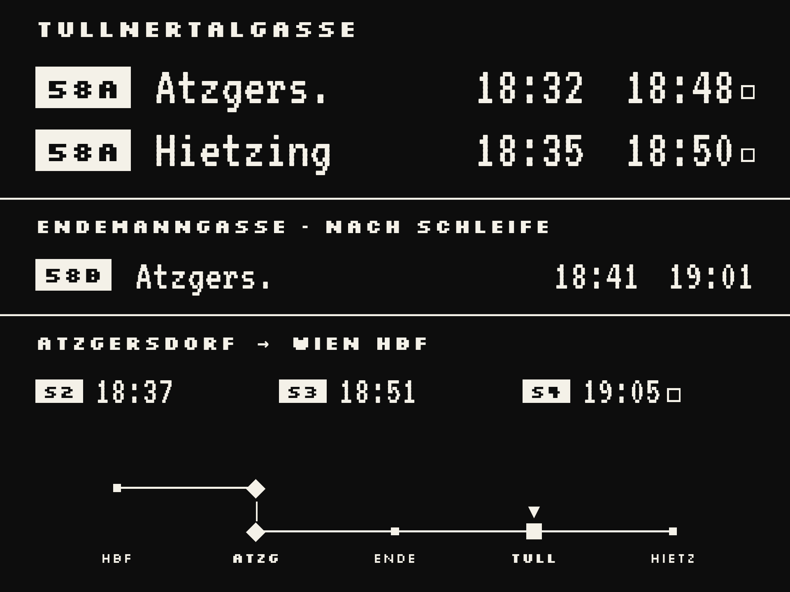
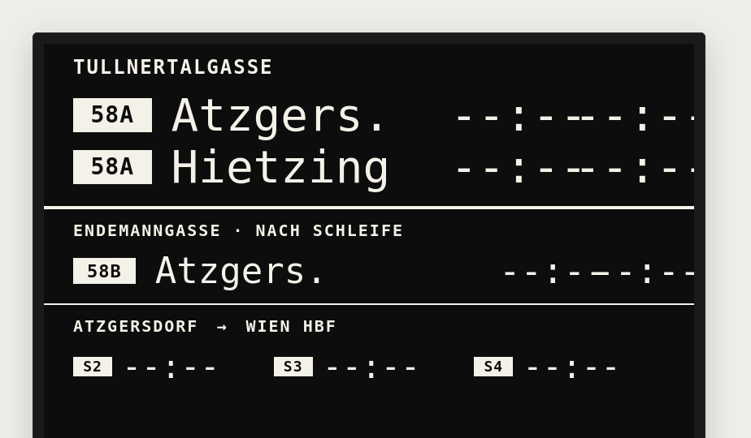
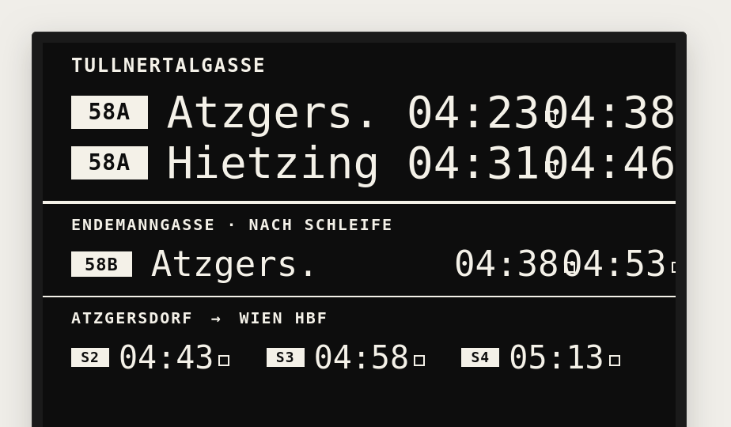
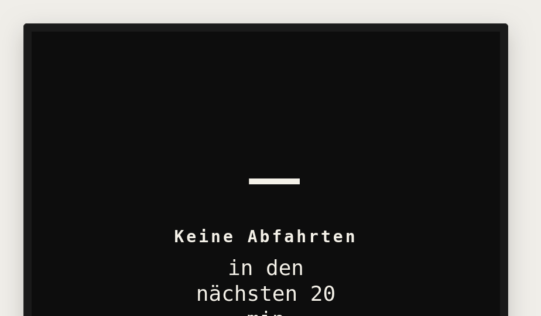
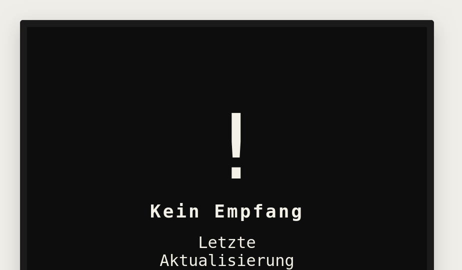
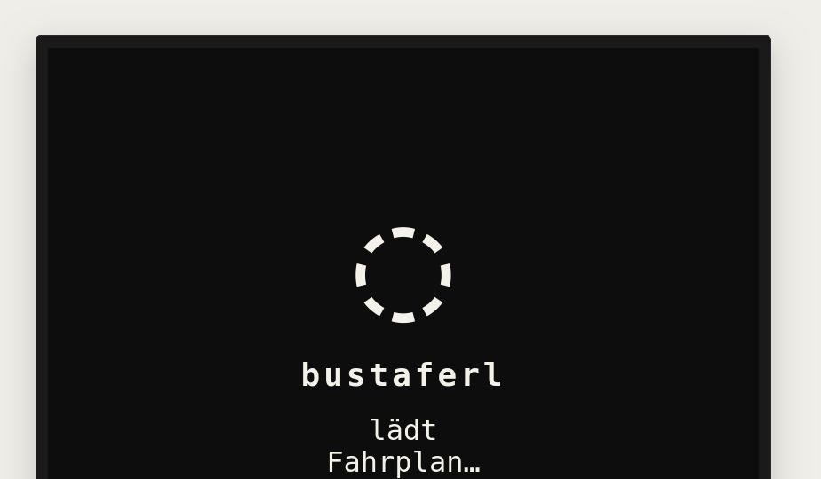

# Benutzerhandbuch

Das Bustaferl ist eine e-Paper-Anzeige fürs Vorzimmer. Es zeigt rohe
Echtzeit-Abfahrten — kein „Du musst jetzt los", keine Countdowns, keine
Bewertung. Die Entscheidung „aufbrechen oder warten" trifft der Mensch
selbst anhand bekannter Gehzeiten.

Dieses Handbuch erklärt, **was auf dem Display zu sehen ist** und **was es
bedeutet**. Inbetriebnahme, Verkabelung und Konfiguration findest du in
[USER.md](USER.md) und [HARDWARE.md](HARDWARE.md).

> Hinweis zu den Screenshots: Die hier eingebetteten Bilder stammen aus
> [`docs/design_handoff_display/`](design_handoff_display/) — software­seitige
> Rasterisierungen des e-Paper-Layouts (400 × 300 px, schwarze Pixel auf
> weißem Hintergrund). Das echte Modul zeigt dieselben Pixel mit dem
> typischen e-Paper-Kontrast.

## 1. Aufbau der Anzeige

Vier Spalten von links nach rechts: **58A → Atzgersdorf**,
**58A → Hietzing**, **58B → Atzgersdorf** und **S-Bahn → Wien Hbf**. Über
dem Spaltenraster ein Header-Balken mit dem aktuellen Datum, darunter pro
Spalte ein Linien-Badge und die jeweilige Richtung. Rechts unten ein
kleiner **Netzplan** mit „you are here"-Marker am Bahnhof Atzgersdorf.



| Spalte                | Linie / Richtung               | Slots pro Spalte |
|-----------------------|--------------------------------|------------------|
| Tullnertalgasse       | 58A → Atzgersdorf              | nächste 2 Abfahrten |
| Tullnertalgasse       | 58A → Hietzing                 | nächste 2 Abfahrten |
| Endemanngasse         | 58B → Atzgersdorf              | nächste 2 Abfahrten |
| Bhf. Atzgersdorf      | S-Bahn → Wien Hbf (S2/S3/S4/REX) | nächste 2 Abfahrten |

Pro Slot wird **eine absolute Uhrzeit** im Format `HH:MM` gezeigt. Keine
Minutenangabe „in X Minuten", keine aktuelle Uhrzeit, keine
Niederflur-Info, keine Empfehlung.

Bei der S-Bahn-Spalte steht **vor** jeder Uhrzeit ein **Linien-Badge**
(`S2`, `S3`, `S4`, `REX`) — anders als bei den Bussen, wo die Linie pro
Spalte konstant ist, kann sie hier pro Slot wechseln.

## 2. Was die einzelnen Werte bedeuten

| Anzeige     | Bedeutung                                                          |
|-------------|--------------------------------------------------------------------|
| `HH:MM`     | Abfahrt — Echtzeit                                                 |
| `□ HH:MM`   | Abfahrt aus Plan-Daten (Echtzeit nicht verfügbar)                  |
| `--:--`     | Stream antwortet, hat aber keine Abfahrt im Horizont               |
| `??:??`     | Veraltet — letzte Echtzeit-Antwort ist älter als die Stale-Schwelle |

Der **Plan-Marker `□`** ist neu in v2: er signalisiert visuell, dass der
Slot Plan-Daten statt Echtzeit zeigt. Häufigster Fall: morgens vor dem
ersten Bus, wo EFA-Plandaten die Echtzeit-Lücke überbrücken.

### Teilweise leere Slots

Wenn nur eine Spalte keine Daten liefert (z. B. weil dort gerade kein
Bus im 70-Minuten-Echtzeit-Fenster steht), bleibt der Rest unverändert
und der betroffene Slot zeigt `--:--`.

## 3. Die sieben Display-States

In v2 ersetzt ein zentraler **State-Selector** die alten v1-Banner. Der
Selector wählt anhand von Datenlage, Uhrzeit, NTP-Sync und letzter
erfolgreicher Antwort einen von sieben Zuständen — sechs davon zeigen ein
charakteristisches Bild, das bewusst nicht mit dem Hauptlayout verwechselt
werden kann.

### Normal


Alles frisch, alle Streams antworten innerhalb der Stale-Schwelle.
Standardansicht.

### Veraltet (Stale)



Letzte erfolgreiche Antwort älter als `STALE_THRESHOLD_S` (~5 min). Alle
Slots zeigen `??:??`, das Layout bleibt aber gleich — du weißt, **welche**
Spalten betroffen sind, vertraust nur den Zeiten nicht mehr.

### Nachtbetrieb (Night)



Außerhalb der Service-Zeit. Die Slots zeigen weiterhin Werte — aber alle
mit Plan-Marker, weil sie aus EFA-Plandaten gespeist sind („Bus in der
Früh"). Sobald die ersten Echtzeit-Abfahrten ins Realtime-Fenster
rutschen, kippt der State zurück auf `Normal`.

### Keine Abfahrten (Quiet)



Wachzeit, alle Endpunkte antworten, aber kein Stream hat eine Fahrt im
Horizont — typische Pause / Wendezeit. Ein einzelnes großes „—" füllt das
Display.

### Kein Empfang (Offline)



WiFi/NTP fehlgeschlagen oder beide Endpunkte schweigen länger als
`OFFLINE_THRESHOLD_S`. Großes Ausrufezeichen + letzter erfolgreicher
Zeitstempel.

### Auth-Fehler (Auth)


HAFAS- oder OGD-Endpunkt liefert wiederholt 401 / Auth-Drift (z. B. weil
der HAFAS-`AID` rotiert wurde). Das Display zeigt einen klaren Hinweis,
dass die Firmware neu konfiguriert und geflasht werden muss — kein
stilles Versagen.

### Boot



Kurzer Splash zwischen Power-on und erstem Render. Zeigt nur den
Firmware-Hash und einen drehenden Punkt. Verschwindet, sobald der erste
Cycle Daten gerendert hat.

## 4. Plan-Marker im Detail

Der Plan-Marker `□` (5×5 Pixel hohler Rahmen, links vor der Uhrzeit) sagt
dir: **„Diese Zeit kommt aus dem Fahrplan, nicht aus der Echtzeit-Spur."**
Praktischer Unterschied:

- Ohne Marker: Bus hat sich in den letzten Sekunden gemeldet, die Zeit
  enthält Verspätung/Vorlauf.
- Mit Marker: Bus ist (noch) nicht in der Echtzeit-Spur sichtbar, du
  siehst die geplante Abfahrt — die *tatsächliche* kann ±2 min davon
  abweichen.

Der Marker erscheint am häufigsten morgens vor dem ersten Bus (EFA-Hint
überbrückt die Lücke) und abends, wenn die letzten Busse längst im Depot
sind und nur noch das nächtliche EFA-Update Daten beigesteuert hat.

## 5. Netzplan im Detail

In der rechten unteren Ecke zeichnet das Display einen kleinen Netzplan
mit den nächsten S-Bahn-Stationen Richtung Hauptbahnhof. Der ausgefüllte
Diamant-Marker markiert **Atzgersdorf** („you are here") — eine
Orientierung, die für Gäste oder bei seltener Nutzung der S-Bahn-Spalte
hilft.

## 6. Aktualisierungs-Rhythmus

Das Bustaferl wechselt zwischen **Wach-** und **Tiefschlaf-Phasen**, um
Strom zu sparen. Was wann passiert:

| Auslöser | Aktion | Frequenz |
|----------|--------|----------|
| Wachzustand | OGD-Batch + HAFAS-Call (4 Streams) | alle **30 s** |
| Datenänderung gegenüber letztem Bild | Partial Refresh (~0,5 s, kein Blinken) | bei jeder Änderung |
| Kein Unterschied | Display wird **nicht** angefasst | (statisch) |
| Anti-Ghosting | Light Full Refresh (1× S/W-Flash + Bild) | alle **2 h** |
| Tiefster nächtlicher Schlaf | Deep Clean (3× S/W-Flash + Bild) | **1×/Nacht** |
| Uhren-Sync | NTP-Sync | **1×/24 h**, gemeinsam mit Deep Clean |
| Plan-Hints | EFA-Fetch für „Bus in der Früh" | **1×/Nacht** + Cold Boot |

### Was wird beim Refresh aktualisiert?

Nicht das ganze Display. Der Renderer baut intern ein neues Bild,
vergleicht es Pixel-für-Pixel mit dem zuletzt gezeigten, und ändert nur
die **geänderten** Bereiche (Bounding Box, X-Achse auf 8-Pixel-Grenzen
gerundet). Das spart Strom und beugt Ghosting vor.

### Wake-Logik im Detail

Nach jedem Render berechnet das Gerät den nächsten Aufwach-Zeitpunkt:

```text
t_ref   = min(alle angezeigten Abfahrtszeiten über alle 4 Streams)
wake_at = t_ref − 15 min − 30 s Boot-Margin
```

- Bleibt mehr als **2 min** bis `wake_at` → **Tiefschlaf** (< 50 µA)
- Weniger als 2 min → **durchgängig wach**, Light Sleep zwischen Polls
- Wake-Punkt liegt in der Vergangenheit → **sofort wach**, regulärer 30-s-Poll

Während des Tiefschlafs bleibt der letzte Render auf dem Display
sichtbar — e-Paper hält das Bild ohne Strom.

## 7. Wenn etwas wirklich klemmt

| Symptom | Erste Maßnahme |
|---------|----------------|
| Display bleibt komplett leer | Verkabelung BUSY/RST prüfen, BS-Jumper auf 0 |
| Ghosting wird sichtbar | warten — Light Full nach max. 2 h, Deep Clean nachts |
| Uhr läuft falsch | NTP-Server erreichbar? `TZ_INFO` in `config.h` korrekt? |
| Display zeigt **Auth** | HAFAS-`AID` in `config.h` rotiert — siehe USER.md („AID erneuern") |
| Display zeigt **Offline** trotz WiFi | Endpunkte schweigen — ÖBB- oder Wiener-Linien-Ausfall, abwarten |
| Sonderzeichen werden falsch dargestellt | Bitmap-Fonts sind 7-bit-ASCII; deutsche Umlaute sind im Layout absichtlich vermieden |

Tieferes Troubleshooting in [USER.md](USER.md#troubleshooting).

## 8. Stromversorgung

Hauptsächlich Tiefschlaf, < 50 µA Stromaufnahme zwischen den Wachphasen.

- **USB-Netzteil:** Dauerbetrieb, problemlos
- **Akku (18650 + LDO):** mehrere Wochen pro Ladung realistisch, abhängig
  von Render-Häufigkeit und WiFi-Verbindungszeit
