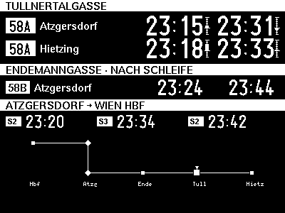
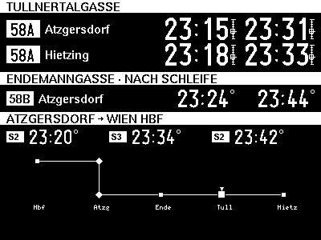
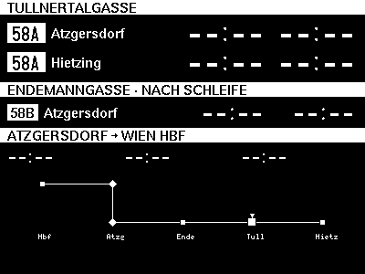
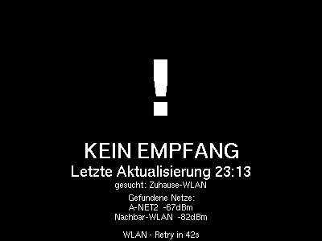

# Benutzerhandbuch

Das Bustaferl ist eine e-Paper-Anzeige fürs Vorzimmer. Es zeigt rohe
Echtzeit-Abfahrten — kein „Du musst jetzt los", keine Countdowns, keine
Bewertung. Die Entscheidung „aufbrechen oder warten" trifft der Mensch
selbst anhand bekannter Gehzeiten.

Dieses Handbuch erklärt, **was auf dem Display zu sehen ist** und **was es
bedeutet**. Inbetriebnahme, Verkabelung und Konfiguration findest du in
[USER.md](USER.md) und [HARDWARE.md](HARDWARE.md).

> Hinweis zu den Screenshots: Die hier eingebetteten Bilder stammen aus
> [`docs/screenshots/`](screenshots/) — Host-Rasterisierungen des
> e-Paper-Layouts (400 × 300 px), erzeugt von `make test-native-png`. Das echte
> Modul zeigt dieselben Pixel mit dem typischen e-Paper-Kontrast.

## 1. Aufbau der Anzeige

Vier Spalten von links nach rechts: **58A → Atzgersdorf**,
**58A → Hietzing**, **58B → Atzgersdorf** und **S-Bahn → Wien Hbf**. Über
dem Spaltenraster ein Header-Balken mit dem aktuellen Datum, darunter pro
Spalte ein Linien-Badge und die jeweilige Richtung. Rechts unten ein
kleiner **Netzplan** mit „you are here"-Marker am Bahnhof Atzgersdorf.


| Spalte                | Linie / Richtung               | Slots pro Spalte |
|-----------------------|--------------------------------|------------------|
| Tullnertalgasse       | 58A → Atzgersdorf              | nächste 2 Abfahrten |
| Tullnertalgasse       | 58A → Hietzing                 | nächste 2 Abfahrten |
| Endemanngasse         | 58B → Atzgersdorf              | nächste 2 Abfahrten |
| Bhf. Atzgersdorf      | S-Bahn → Wien Hbf (S2/S3/S4/REX) | nächste 3 Abfahrten |

Die S-Bahn-Spalte zeigt **drei** Abfahrten (die Bus-Spalten zwei), weil der
Wegfall der zweiten Richtung dort den Platz freigibt und die Stammstrecke
dicht genug getaktet ist, dass ein dritter Slot Mehrwert hat.

Pro Slot wird **eine absolute Uhrzeit** im Format `HH:MM` gezeigt. Keine
Minutenangabe „in X Minuten", keine aktuelle Uhrzeit, keine
Niederflur-Info, keine Empfehlung.

Bei der S-Bahn-Spalte steht **vor** jeder Uhrzeit ein **Linien-Badge**
(`S2`, `S3`, `S4`, `REX`) — anders als bei den Bussen, wo die Linie pro
Spalte konstant ist, kann sie hier pro Slot wechseln.

## 2. Was die einzelnen Werte bedeuten

| Anzeige     | Bedeutung                                                          |
|-------------|--------------------------------------------------------------------|
| `HH:MM`     | Abfahrt — Echtzeit                                                 |
| `□ HH:MM`   | Abfahrt aus Plan-Daten (Echtzeit nicht verfügbar)                  |
| `--:--`     | Slot ohne Abfahrt — weder Echtzeit noch Fahrplan haben etwas       |

Der **Plan-Marker `□`** signalisiert visuell, dass der Slot Plan-Daten statt
Echtzeit zeigt. Häufigster Fall: morgens vor dem ersten Bus, wo EFA-Plandaten
die Echtzeit-Lücke überbrücken. Es gibt **keinen** eigenen „Veraltet"-Zustand
mehr: Fällt die Echtzeit aus, zeigt das Board die geplanten Abfahrten weiter;
nur wenn auch der Fahrplan nichts hat, steht dort `--:--`.

### Abweichungs-Anzeige (nur 58A)

Neben jeder **58A**-Zeit mit Echtzeit-Tracking steht eine kleine senkrechte
Skala: sie zeigt **Echtzeit minus Fahrplan** als Balken. Ein Balken **nach
oben** heißt „später als geplant" (Verspätung), **nach unten** „früher als
geplant". Die breite Mittelmarke ist die Fahrplan-Linie (0). So ist erkennbar,
dass ein scheinbar rückwärts springender Slot (z. B. `07:02 → 07:01 → 07:00`)
nur eine **Live-Korrektur** ist und kein Datenfehler — der Balken steht dann
kurz unter der Null. Ein hohles Kästchen auf der Null bedeutet „nur Fahrplan,
kein Echtzeit-Vergleich". 58B und die S-Bahn haben diese Anzeige nicht.

### Teilweise leere Slots

Wenn nur eine Spalte keine Daten liefert (z. B. weil dort gerade kein
Bus im 70-Minuten-Echtzeit-Fenster steht), bleibt der Rest unverändert
und der betroffene Slot zeigt `--:--`.

## 3. Das Board und die Sonderfall-Screens

Ein zentraler **State-Selector** wählt pro Zyklus, was gezeigt wird. Die
Grundregel ist einfach: **Solange irgendeine Abfahrt bekannt ist — Echtzeit
oder Fahrplan — zeigt das Gerät das Abfahrts-Board.** Nur vier klar
unterscheidbare Fehler-/Platzhalter-Screens ersetzen das Board ganz.

### Das Board — vier Daten-Fälle, ein Layout

Das Board sieht immer gleich aus; nur die *Daten* wechseln. Es gibt keinen
eigenen „Nacht"-, „Veraltet"- oder „Keine Abfahrten"-Screen mehr — die
nächste Abfahrt wird immer mit ihrer echten Uhrzeit gezeigt, auch wenn sie
Stunden entfernt liegt.

**Gemischt (Echtzeit + Plan)** — der Alltag: nahe Abfahrten live
(Abweichungs-Balken), spätere aus dem Fahrplan (Plan-Marker).


**Nur Echtzeit** — alle Streams liefern Live-Daten; die 58A-Skalen zeigen
Abweichungs-Balken statt hohler Kästchen.



**Nur Fahrplan** — z. B. nachts / vor dem ersten Bus: alle Zeiten aus EFA,
mit Plan-Marker bzw. hohlem Kästchen auf der 58A-Skala. Sobald Echtzeit
verfügbar ist, füllt sie die Slots automatisch.



**Keine Daten** — weder Echtzeit noch Fahrplan haben etwas: alle Slots
`--:--`, aber Layout, Badges und Netzplan bleiben stehen. (Fällt nur ein
Fetch aus, behält das Gerät stattdessen das letzte gute Bild.)



### Kein Empfang (Offline)



WiFi weg und der letzte Erfolg länger als `OFFLINE_THRESHOLD_S` (5 min) her.
Großes Ausrufezeichen, letzter erfolgreicher Zeitstempel und die gefundenen
WLAN-Netze (mit Case-Mismatch-Hinweis, falls die SSID nur in der
Groß-/Kleinschreibung abweicht).

### Auth-Fehler (Auth)


HAFAS- oder OGD-Endpunkt liefert wiederholt 401 / Auth-Drift (z. B. weil
der HAFAS-`AID` rotiert wurde). Das Display zeigt einen klaren Hinweis,
dass die Firmware neu konfiguriert und geflasht werden muss — kein
stilles Versagen.

### WLAN-Passwort falsch (WifiAuth)


Der WPA-Handshake ist endgültig gescheitert (falsches Passwort in
`secrets.h`). Retrys können nicht helfen, deshalb nennt der Screen die
betroffene SSID und das Gerät legt sich für eine Stunde schlafen, statt die
60-s-Retry-Schleife zu drehen.

### Boot


Kurzer Splash zwischen Power-on und erstem Render. Zeigt einen
gepunkteten Kreis, den Schriftzug „BUSTAFERL", die Zeile „lädt
Fahrplan..." und unten die Firmware-Version (`DISPLAY_VERSION_STR`, z. B.
`v2.0 · UC8176 · 400×300`). Verschwindet, sobald der erste Cycle Daten
gerendert hat. Ein Reset im laufenden Betrieb (z. B. Brownout) zeigt den
Boot-Screen **nicht** erneut — hat das Gerät bereits Daten, geht es direkt
ins Board.

## 4. Plan-Marker im Detail

Der Plan-Marker `□` (5×5 Pixel hohler Rahmen, links vor der Uhrzeit) sagt
dir: **„Diese Zeit kommt aus dem Fahrplan, nicht aus der Echtzeit-Spur."**
Praktischer Unterschied:

- Ohne Marker: Bus hat sich in den letzten Sekunden gemeldet, die Zeit
  enthält Verspätung/Vorlauf.
- Mit Marker: Bus ist (noch) nicht in der Echtzeit-Spur sichtbar, du
  siehst die geplante Abfahrt — die *tatsächliche* kann ±2 min davon
  abweichen.

Der Marker erscheint am häufigsten morgens vor dem ersten Bus (EFA-Hint
überbrückt die Lücke) und abends, wenn die letzten Busse längst im Depot
sind und nur noch das nächtliche EFA-Update Daten beigesteuert hat.

## 5. Netzplan im Detail

In der rechten unteren Ecke zeichnet das Display einen kleinen Netzplan
mit den nächsten S-Bahn-Stationen Richtung Hauptbahnhof. Der ausgefüllte
Diamant-Marker markiert **Atzgersdorf** („you are here") — eine
Orientierung, die für Gäste oder bei seltener Nutzung der S-Bahn-Spalte
hilft.

## 6. Aktualisierungs-Rhythmus

Das Bustaferl wechselt zwischen **Wach-** und **Tiefschlaf-Phasen**, um
Strom zu sparen. Was wann passiert:

| Auslöser | Aktion | Frequenz |
|----------|--------|----------|
| Wachzustand | OGD-Batch + HAFAS-Call (4 Streams) | alle **30 s** |
| Datenänderung gegenüber letztem Bild | Partial Refresh (~0,5 s, kein Blinken) | bei jeder Änderung |
| Kein Unterschied | Display wird **nicht** angefasst | (statisch) |
| Unvollständiger Fetch | Rescue-Fetch: Nachhol-Versuch + genau ein Extra-Refresh | im Fenster **20–40 s** nach dem Update |
| Anti-Ghosting | Light Full Refresh (1× S/W-Flash + Bild) | alle **1 h** oder nach 15 Partials |
| Tiefster nächtlicher Schlaf | Deep Clean (3× S/W-Flash + Bild) | **1×/Nacht** |
| Uhren-Sync | NTP-Sync | **1×/24 h**, gemeinsam mit Deep Clean |
| Plan-Hints | EFA-Fetch für „Bus in der Früh" | **1×/Nacht** + Cold Boot |

**Rescue-Fetch**: Fiel bei einem Poll ein einzelner API-Batch weg (eine
Spalte zeigt `--:--`, obwohl dort etwas fährt), holt das Gerät die Daten im
Fenster 20–40 s nach dem Display-Update nach und schiebt genau einen
zusätzlichen Refresh nach, sobald ein vollständiger Snapshot ankommt. Die
Untergrenze von 20 s hält zwei Panel-Updates auseinander.

### Was wird beim Refresh aktualisiert?

Nicht das ganze Display. Der Renderer baut intern ein neues Bild,
vergleicht es Pixel-für-Pixel mit dem zuletzt gezeigten, und ändert nur
die **geänderten** Bereiche (Bounding Box, X-Achse auf 8-Pixel-Grenzen
gerundet). Das spart Strom und beugt Ghosting vor.

### Wake-Logik im Detail

Nach jedem Render berechnet das Gerät den nächsten Aufwach-Zeitpunkt:

```text
t_ref   = min(alle angezeigten Abfahrtszeiten über alle 4 Streams)
wake_at = t_ref − 15 min − 30 s Boot-Margin
```

- Bleibt mehr als **2 min** bis `wake_at` → **Tiefschlaf** (< 50 µA)
- Weniger als 2 min → **durchgängig wach**, Light Sleep zwischen Polls
- Wake-Punkt liegt in der Vergangenheit → **sofort wach**, regulärer 30-s-Poll

Während des Tiefschlafs bleibt der letzte Render auf dem Display
sichtbar — e-Paper hält das Bild ohne Strom. Der erste Render nach einem
Aufwachen aus dem Tiefschlaf ist immer ein voller Refresh (nicht Partial):
der schnelle Panel-Zwischenspeicher überlebt den Tiefschlaf nicht, ein
Partial würde weiße Ränder und Artefakte hinterlassen.

## 7. Wenn etwas wirklich klemmt

| Symptom | Erste Maßnahme |
|---------|----------------|
| Display bleibt komplett leer | Verkabelung BUSY/RST prüfen, BS-Jumper auf 0 |
| Ghosting wird sichtbar | warten — Light Full nach max. 1 h, Deep Clean nachts |
| Uhr läuft falsch | NTP-Server erreichbar? `TZ_INFO` in `config.h` korrekt? (Ein Wake mit unplausibel weit gesprungener Uhr erzwingt automatisch einen NTP-Resync.) |
| Display zeigt **Auth** | HAFAS-`AID` in `config.h` rotiert — siehe USER.md („AID erneuern") |
| Display zeigt **Offline** trotz WiFi | Endpunkte schweigen — ÖBB- oder Wiener-Linien-Ausfall, abwarten |
| Sonderzeichen werden falsch dargestellt | Bitmap-Fonts sind 7-bit-ASCII; deutsche Umlaute sind im Layout absichtlich vermieden |

Tieferes Troubleshooting in [USER.md](USER.md#troubleshooting).

## 8. Stromversorgung

Hauptsächlich Tiefschlaf, < 50 µA Stromaufnahme zwischen den Wachphasen.

- **USB-Netzteil:** Dauerbetrieb, problemlos
- **Akku (18650 + LDO):** mehrere Wochen pro Ladung realistisch, abhängig
  von Render-Häufigkeit und WiFi-Verbindungszeit

## 9. Der BOOT-Knopf

Der einzige Bedienknopf ist der **BOOT**-Taster (GPIO 0) auf dem ESP32-Board.
Er kennt drei Gesten:

| Geste | Aktion |
|-------|--------|
| **Kurz drücken** | Sofort-Update: Daten neu holen und Anzeige auffrischen — auch aus dem Tiefschlaf heraus. Der Zeitstempel „upd HH:MM" springt immer, auch wenn sich die Abfahrten nicht geändert haben (sichtbare Rückmeldung). |
| **Lang halten** (> 3 s) | S/W-Reset: Ein Deep Clean räumt Ghosting weg und zeichnet das letzte Bild neu. Löst **beim Erreichen der 3 s** aus, nicht erst beim Loslassen. |
| **Doppelklick** | Öffnet den **Diagnose-Modus** (siehe unten). |

Ein manuelles Update darf beliebig lange dauern, unterbricht aber **kein**
laufendes Update — es reiht sich dahinter ein.

## 10. Der Diagnose-Modus

Das Gerät schreibt keine Logs. Wenn dir im Betrieb eine Anomalie in den
angezeigten Daten auffällt, gibt dir der Diagnose-Modus ein Fenster darauf,
**was gerade passiert ist** — als schlichter, dichter Text.

**Öffnen:** Doppelklick auf den BOOT-Knopf (während Betrieb oder direkt nach
einem Button-Aufwecken). Das Gerät holt einmal frische Daten und zeigt dann
die erste Seite.

**Navigieren:**

- **Kurz drücken** → eine Seite weiter (nach der letzten wieder auf die erste).
- **Lang halten** → zurück in den Normalbetrieb.
- Nach spätestens **10 Minuten** ohne Eingabe kehrt das Gerät von selbst zum
  Normalbetrieb zurück (Sicherheits-Timeout).

Beim Verlassen rendert der nächste Zyklus wieder die gewohnte Abfahrtstafel.

**Die vier Seiten:**

1. **STATUS** — WLAN (SSID, IP, Signalstärke), Uhrzeit + NTP-Sync,
   pro Stream ein Selbsttest (antwortet der Endpunkt? kommt eine Abfahrt?),
   Streak-Zähler (58B-Filter, ÖBB-Auth), freier Heap und Uptime.
2. **ZYKLEN** — die jüngsten Aufwach-Zyklen: Uhrzeit,
   Auslöser (T=Timer, B=Button, C=Cold-Boot; neueste zuerst), welche Streams OK waren,
   fehlgeschlagene Batches, Rescue-Marker und die geplante Schlafdauer.
3. **FEHLER** — die jüngsten Anomalien im Klartext (z. B. „OEBB lehnt Zugang
   ab", „WL-Monitor: HTTP-Fehler", „Zeitabgleich fehlgeschlagen").
4. **DATEN-DETAILS** — pro Slot die Quelle (E=Echtzeit, P=Plan, H=Hint) und
   Zeit, wann der Morgen-Fahrplan geladen wurde, sowie der Panel-Zustand
   (Partials, letzter Light-Full / Deep-Clean).

Die Zyklen- und Fehler-Historie liegt im RTC-Speicher und übersteht den
Tiefschlaf — sie geht nur bei komplettem Stromverlust verloren.

## 11. Boot-Check nach dem Kaltstart

Nach einem Kaltstart (Strom an / Reset) zeigt das Gerät für **15 Sekunden**
einen **Boot-Check** — dieselbe STATUS-Übersicht plus ein paar
Start-spezifische Zeilen: ob die RTC-Speicher (Meta / Bild / Fahrplan)
erhalten geblieben sind, wie viele Abfragen beim ersten Versuch klappten und
im wievielten Anlauf sich WLAN & NTP verbunden haben. Ein Tastendruck
überspringt die Anzeige sofort; danach startet die normale Abfahrtstafel.
