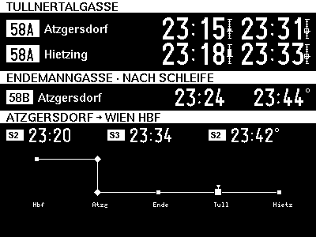
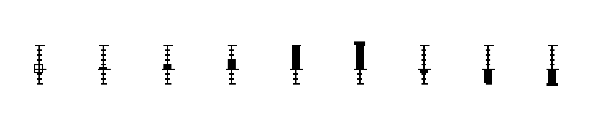

# Bustaferl — Kurzreferenz

> **Zeigt rohe Echtzeit. Keine Empfehlung. Du entscheidest.**
> Das Ausführliche steht in [HANDBUCH.md](HANDBUCH.md) — dieses Blatt ist die
> Version zum Danebenlegen.

## So sieht der normale Screen aus

- **Die großen Uhrzeiten** = Echtzeit (live).
- **Das kleine „°"** (z. B. `23:44°` bei 58B) = Fahrplan statt Echtzeit.
- **Die kleine senkrechte Skala** rechts neben den 58A-Zeiten = Verspätung
  (siehe unten).
- **Der ausgefüllte Diamant** im Netzplan unten = Atzgersdorf, „du bist hier".

## Was am Bildschirm steht

Vier Spalten, jeweils die **absolute Uhrzeit** `HH:MM` (kein „in X min"):

| Spalte | Richtung | Abfahrten |
|--------|----------|-----------|
| **58A** · Tullnertalgasse | → Atzgersdorf | nächste 2 |
| **58A** · Tullnertalgasse | → Hietzing | nächste 2 |
| **58B** · Endemanngasse | → Atzgersdorf | nächste 2 |
| **S-Bahn** · Bhf. Atzgersdorf | → Wien Hbf (S2/S3/S4/REX) | nächste 3 |

Rechts unten ein kleiner Netzplan; der ausgefüllte Marker ● ist **Atzgersdorf**
(„du bist hier").

## Die Symbole

| Anzeige | Bedeutung |
|---------|-----------|
| `07:14` | **Echtzeit** — der Bus meldet sich live. |
| `07:14°` | **Fahrplan** — noch keine Echtzeit; das „°" steht rechts oben. |
| `--:--` | **Kein Bus** in Sicht — weder Echtzeit noch Fahrplan. |

## Die Verspätungs-Skala (nur 58A)

Neben jeder 58A-Zeit mit Live-Tracking steht eine kleine senkrechte Skala:
**Echtzeit minus Fahrplan** als Balken.

| Form | Bedeutung |
|------|-----------|
| Balken **nach oben** | später als geplant (**Verspätung**) |
| Balken **nach unten** | früher als geplant |
| kurzer Nub auf der Mitte | pünktlich (±0) |
| hohles **Kästchen** | nur Fahrplan, kein Live-Vergleich |
| Anschlag oben/unten + kleiner Sporn | mehr als der angezeigte Bereich (+5 / −3 min) |

**Merkregel:** Mittelmarke = Fahrplan · hoch = zu spät · runter = zu früh ·
Kästchen = (noch) keine Echtzeit. Springt eine Zeit scheinbar zurück
(`07:02 → 07:00`), ist das eine **Live-Korrektur**, kein Fehler.

## Der Knopf („BOOT")

| Geste | Aktion |
|-------|--------|
| **Kurz drücken** | Sofort aktualisieren — auch aus dem Schlaf. |
| **Lang halten** (> 3 s) | Bildschirm auffrischen — räumt „Schatten" (Ghosting) weg. |
| **Doppelklick** | Diagnose-Seiten öffnen (blättern: kurz = weiter, lang = zurück). |

## Wenn statt Abfahrten ein Bild kommt

| Bild | Bedeutung | Was tun |
|------|-----------|---------|
| Großes **„!"** | Kein WLAN. Zeigt die gefundenen Netze. | warten oder Router prüfen |
| **Auth / AID** | ÖBB-Zugangsschlüssel abgelaufen. | Firmware neu flashen (Besitzer) |
| **WLAN-Passwort falsch** | WPA-Handshake gescheitert. | Passwort in `secrets.h` prüfen |
| Punkte-Kreis · **„lädt Fahrplan"** | Startbild nach dem Einschalten. | nichts — verschwindet von selbst |

---

Das e-Paper hält das Bild auch **ohne Strom**. Aktualisierung ~alle 30 s im
Wachzustand, sonst Tiefschlaf.
