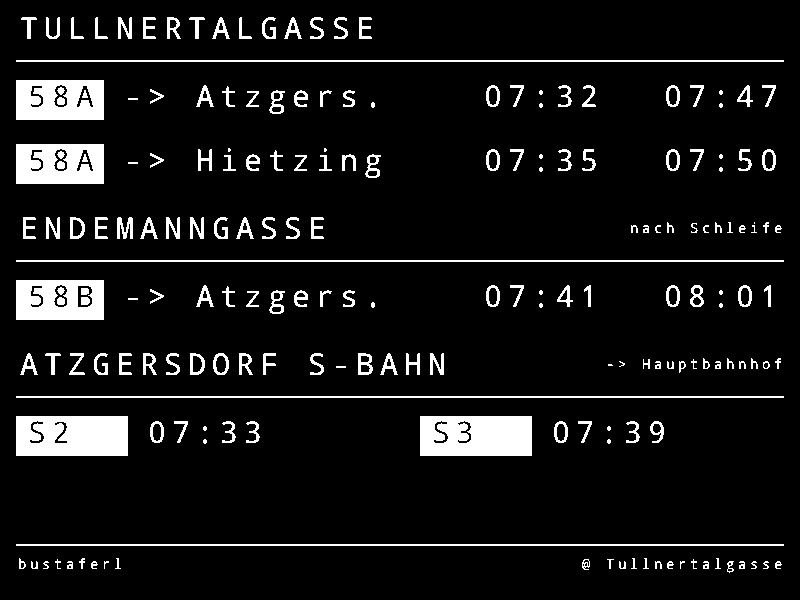
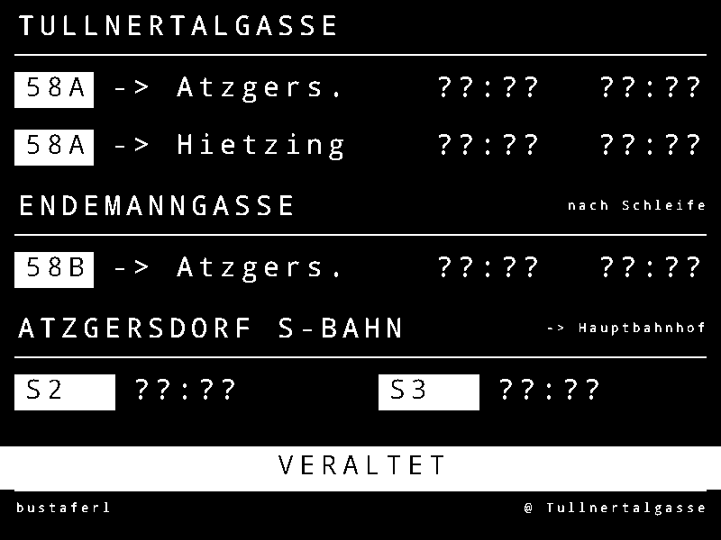
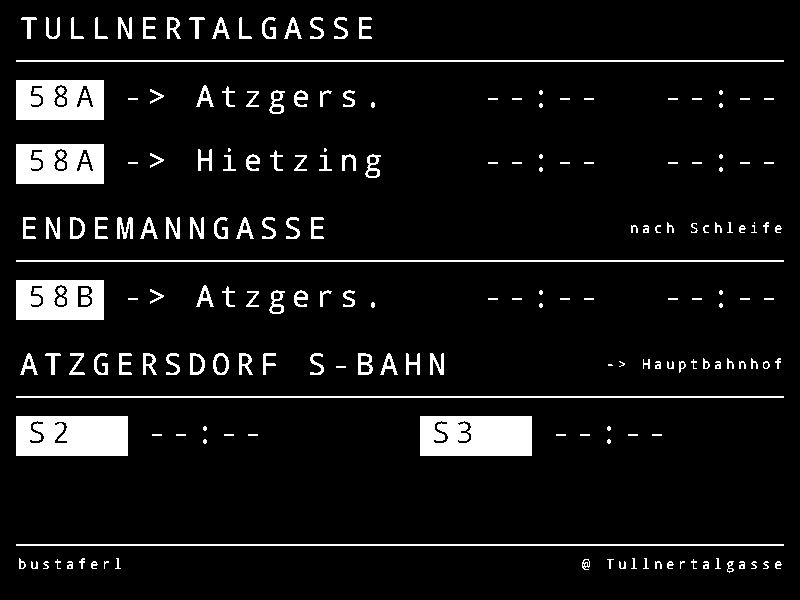
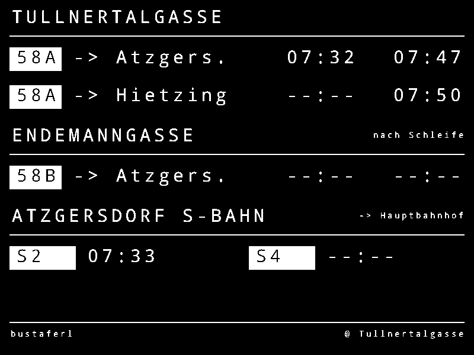
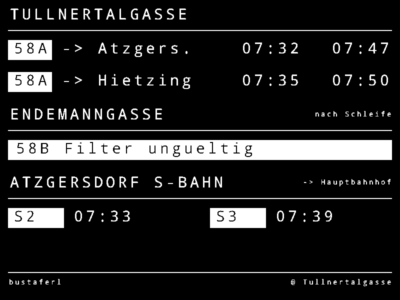
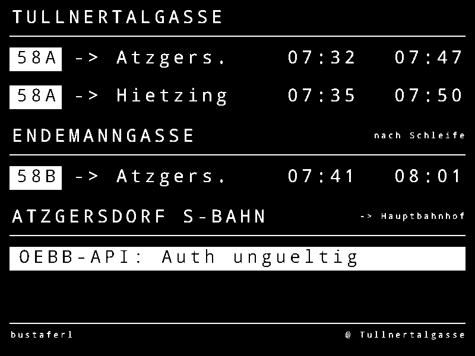
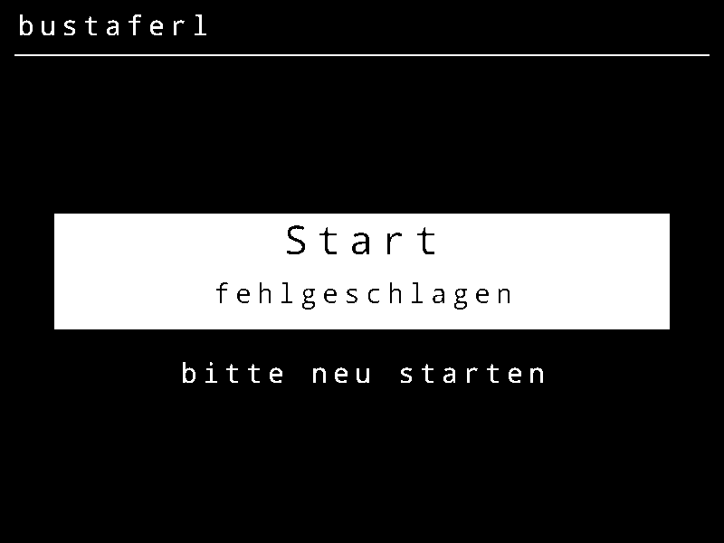
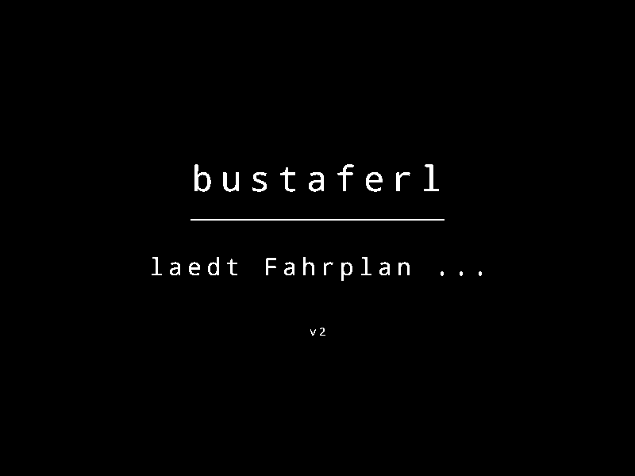

# bustaferl v2 — Display Handoff Spec

Render target: **Waveshare 4.2" e-paper, 400 × 300, 1-bit (pure black/white)**.

This document is the rendering contract for the v2 departure board. Every frame is
drawn with the device toolbox only — a classic 6×8 monospace font at integer scale,
white-on-black, no anti-aliasing, no gray, no opacity, ASCII only. Each pixel is
thresholded to pure B/W. The op draw-lists below are the source of truth: transcribe
them directly into `drawSBahnSlot` / `renderFrame`.

> Generated from the same op arrays that paint the visual mockups. Coordinates are
> top-left cursor in device pixels. `color` is `ink` (black) or `paper` (white).
>
> Mockup PNGs (`images/`) are rendered from these op-lists at 2× and thresholded to true 1-bit; display width 400 = native device resolution.

---

## A · Font declaration

```text
family   classic 6x8 monospace, integer-scaled (ASCII only)

size  cell WxH   used for
  1   6 x 8      footer, section notes
  2   12 x 16    headers, badges, all time tokens, banners
  3   18 x 24    splash wordmark, fatal-error headline

time token = 5 chars -> size2 width = 5*12 = 60 px
state cursor = top-left of cell (classic convention)
```

## B · Region map

```text
x columns          left margin 8  right margin 8  (content 8..392)
  bus badge        x 8   w 44
  bus dest         x 60
  bus time 1       x 240   w 60
  bus time 2       x 330   w 60
  s-bahn slot1     badge x 8 w56   time x 72
  s-bahn slot2     badge x 210 w56   time x 274

y bands
  TULLNERTALGASSE  header 8  rule 30  rowA 42  rowB 74
  ENDEMANNGASSE    header 108 rule 130 rowC 142
  ATZGERSDORF      header 176 rule 198 rowD 210
  banner (states)  y 248..272
  footer           rule 272 text 279
```

## C · Fit proof

```text
bound: every right edge <= 392 (W - margin)

bus row  dest "-> Atzgers."  x60 + 11*12=132  -> right 192   gap to t1 = 48
         time1  x240 + 60 -> 300      gap to t2 = 30
         time2  x330 + 60 -> 390  <= 392  OK

s-bahn   badge "REX1" 4*12=48 + 8 pad = 56  (widest label fits)
         slot1 badge x8..64   time x72 + 60 -> 132
         slot2 badge x210..266   time x274 + 60 -> 334  <= 392  OK
         bigSBahn=on: time width 5*18=90 -> slot2 right 364  <= 392  OK

banners  "OEBB-API: Auth ungueltig" 24*12=288 <= section width 384  OK
         "58B Filter ungueltig"     20*12=240 <= 384  OK
```

---

## D · Draw-lists per state

Op columns: `op` · `text` · `x,y` · `size/dim` · `color`. The canvas is cleared to
`ink` (full black) first; every subsequent op paints `paper` (white) unless noted.

### 01 · Normal



All four streams live. Roll-sign line badges, two next-times per bus row, two next trains for the S-Bahn.

```text
fillrect                     0,0      400x300    ink
text     "TULLNERTALGASSE"   8,8      classic/2  paper
hline                        8,30     w=384      paper
fillrect                     8,40     44x20      paper
text     "58A"               12,42    classic/2  ink
text     "-> Atzgers."       60,42    classic/2  paper
text     "07:32"             240,42   classic/2  paper
text     "07:47"             330,42   classic/2  paper
fillrect                     8,72     44x20      paper
text     "58A"               12,74    classic/2  ink
text     "-> Hietzing"       60,74    classic/2  paper
text     "07:35"             240,74   classic/2  paper
text     "07:50"             330,74   classic/2  paper
text     "ENDEMANNGASSE"     8,108    classic/2  paper
text     "nach Schleife"     314,111  classic/1  paper
hline                        8,130    w=384      paper
fillrect                     8,140    44x20      paper
text     "58B"               12,142   classic/2  ink
text     "-> Atzgers."       60,142   classic/2  paper
text     "07:41"             240,142  classic/2  paper
text     "08:01"             330,142  classic/2  paper
text     "ATZGERSDORF S-BAHN"8,176    classic/2  paper
text     "-> Hauptbahnhof"   302,179  classic/1  paper
hline                        8,198    w=384      paper
fillrect                     8,208    56x20      paper
text     "S2"                12,210   classic/2  ink
text     "07:33"             72,210   classic/2  paper
fillrect                     210,208  56x20      paper
text     "S3"                214,210  classic/2  ink
text     "07:39"             274,210  classic/2  paper
hline                        8,272    w=384      paper
text     "bustaferl"         8,279    classic/1  paper
text     "@ Tullnertalgasse" 290,279  classic/1  paper
```

### 02 · VERALTET (stale)



Feed older than tolerance: every time renders ??:?? and an inverted VERALTET banner spans the board.

```text
fillrect                     0,0      400x300    ink
text     "TULLNERTALGASSE"   8,8      classic/2  paper
hline                        8,30     w=384      paper
fillrect                     8,40     44x20      paper
text     "58A"               12,42    classic/2  ink
text     "-> Atzgers."       60,42    classic/2  paper
text     "??:??"             240,42   classic/2  paper
text     "??:??"             330,42   classic/2  paper
fillrect                     8,72     44x20      paper
text     "58A"               12,74    classic/2  ink
text     "-> Hietzing"       60,74    classic/2  paper
text     "??:??"             240,74   classic/2  paper
text     "??:??"             330,74   classic/2  paper
text     "ENDEMANNGASSE"     8,108    classic/2  paper
text     "nach Schleife"     314,111  classic/1  paper
hline                        8,130    w=384      paper
fillrect                     8,140    44x20      paper
text     "58B"               12,142   classic/2  ink
text     "-> Atzgers."       60,142   classic/2  paper
text     "??:??"             240,142  classic/2  paper
text     "??:??"             330,142  classic/2  paper
text     "ATZGERSDORF S-BAHN"8,176    classic/2  paper
text     "-> Hauptbahnhof"   302,179  classic/1  paper
hline                        8,198    w=384      paper
fillrect                     8,208    56x20      paper
text     "S2"                12,210   classic/2  ink
text     "??:??"             72,210   classic/2  paper
fillrect                     210,208  56x20      paper
text     "S3"                214,210  classic/2  ink
text     "??:??"             274,210  classic/2  paper
fillrect                     0,248    400x24     paper
text     "VERALTET"          152,252  classic/2  ink
hline                        8,272    w=384      paper
text     "bustaferl"         8,279    classic/1  paper
text     "@ Tullnertalgasse" 290,279  classic/1  paper
```

### 03 · No departures / night



Valid feed, nothing scheduled: --:-- placeholders, no error chrome. Footer states keine Abfahrten.

```text
fillrect                     0,0      400x300    ink
text     "TULLNERTALGASSE"   8,8      classic/2  paper
hline                        8,30     w=384      paper
fillrect                     8,40     44x20      paper
text     "58A"               12,42    classic/2  ink
text     "-> Atzgers."       60,42    classic/2  paper
text     "--:--"             240,42   classic/2  paper
text     "--:--"             330,42   classic/2  paper
fillrect                     8,72     44x20      paper
text     "58A"               12,74    classic/2  ink
text     "-> Hietzing"       60,74    classic/2  paper
text     "--:--"             240,74   classic/2  paper
text     "--:--"             330,74   classic/2  paper
text     "ENDEMANNGASSE"     8,108    classic/2  paper
text     "nach Schleife"     314,111  classic/1  paper
hline                        8,130    w=384      paper
fillrect                     8,140    44x20      paper
text     "58B"               12,142   classic/2  ink
text     "-> Atzgers."       60,142   classic/2  paper
text     "--:--"             240,142  classic/2  paper
text     "--:--"             330,142  classic/2  paper
text     "ATZGERSDORF S-BAHN"8,176    classic/2  paper
text     "-> Hauptbahnhof"   302,179  classic/1  paper
hline                        8,198    w=384      paper
fillrect                     8,208    56x20      paper
text     "S2"                12,210   classic/2  ink
text     "--:--"             72,210   classic/2  paper
fillrect                     210,208  56x20      paper
text     "S3"                214,210  classic/2  ink
text     "--:--"             274,210  classic/2  paper
hline                        8,272    w=384      paper
text     "bustaferl"         8,279    classic/1  paper
text     "@ Tullnertalgasse" 290,279  classic/1  paper
```

### 04 · Partial



Some streams returned, some empty. Missing slots fall back to --:-- in place; structure stays intact.

```text
fillrect                     0,0      400x300    ink
text     "TULLNERTALGASSE"   8,8      classic/2  paper
hline                        8,30     w=384      paper
fillrect                     8,40     44x20      paper
text     "58A"               12,42    classic/2  ink
text     "-> Atzgers."       60,42    classic/2  paper
text     "07:32"             240,42   classic/2  paper
text     "07:47"             330,42   classic/2  paper
fillrect                     8,72     44x20      paper
text     "58A"               12,74    classic/2  ink
text     "-> Hietzing"       60,74    classic/2  paper
text     "--:--"             240,74   classic/2  paper
text     "07:50"             330,74   classic/2  paper
text     "ENDEMANNGASSE"     8,108    classic/2  paper
text     "nach Schleife"     314,111  classic/1  paper
hline                        8,130    w=384      paper
fillrect                     8,140    44x20      paper
text     "58B"               12,142   classic/2  ink
text     "-> Atzgers."       60,142   classic/2  paper
text     "--:--"             240,142  classic/2  paper
text     "--:--"             330,142  classic/2  paper
text     "ATZGERSDORF S-BAHN"8,176    classic/2  paper
text     "-> Hauptbahnhof"   302,179  classic/1  paper
hline                        8,198    w=384      paper
fillrect                     8,208    56x20      paper
text     "S2"                12,210   classic/2  ink
text     "07:33"             72,210   classic/2  paper
fillrect                     210,208  56x20      paper
text     "S4"                214,210  classic/2  ink
text     "--:--"             274,210  classic/2  paper
hline                        8,272    w=384      paper
text     "bustaferl"         8,279    classic/1  paper
text     "@ Tullnertalgasse" 290,279  classic/1  paper
```

### 05 · 58B Filter ungueltig



Endemanngasse filter rejected by the API. Only that section inverts to a banner; other streams keep running.

```text
fillrect                     0,0      400x300    ink
text     "TULLNERTALGASSE"   8,8      classic/2  paper
hline                        8,30     w=384      paper
fillrect                     8,40     44x20      paper
text     "58A"               12,42    classic/2  ink
text     "-> Atzgers."       60,42    classic/2  paper
text     "07:32"             240,42   classic/2  paper
text     "07:47"             330,42   classic/2  paper
fillrect                     8,72     44x20      paper
text     "58A"               12,74    classic/2  ink
text     "-> Hietzing"       60,74    classic/2  paper
text     "07:35"             240,74   classic/2  paper
text     "07:50"             330,74   classic/2  paper
text     "ENDEMANNGASSE"     8,108    classic/2  paper
text     "nach Schleife"     314,111  classic/1  paper
hline                        8,130    w=384      paper
fillrect                     8,140    384x20     paper
text     "58B Filter ungueltig"  14,142   classic/2  ink
text     "ATZGERSDORF S-BAHN"8,176    classic/2  paper
text     "-> Hauptbahnhof"   302,179  classic/1  paper
hline                        8,198    w=384      paper
fillrect                     8,208    56x20      paper
text     "S2"                12,210   classic/2  ink
text     "07:33"             72,210   classic/2  paper
fillrect                     210,208  56x20      paper
text     "S3"                214,210  classic/2  ink
text     "07:39"             274,210  classic/2  paper
hline                        8,272    w=384      paper
text     "bustaferl"         8,279    classic/1  paper
text     "@ Tullnertalgasse" 290,279  classic/1  paper
```

### 06 · OEBB-API: Auth ungueltig



S-Bahn auth failed. The Atzgersdorf section inverts to an error banner; the two bus sections are unaffected.

```text
fillrect                     0,0      400x300    ink
text     "TULLNERTALGASSE"   8,8      classic/2  paper
hline                        8,30     w=384      paper
fillrect                     8,40     44x20      paper
text     "58A"               12,42    classic/2  ink
text     "-> Atzgers."       60,42    classic/2  paper
text     "07:32"             240,42   classic/2  paper
text     "07:47"             330,42   classic/2  paper
fillrect                     8,72     44x20      paper
text     "58A"               12,74    classic/2  ink
text     "-> Hietzing"       60,74    classic/2  paper
text     "07:35"             240,74   classic/2  paper
text     "07:50"             330,74   classic/2  paper
text     "ENDEMANNGASSE"     8,108    classic/2  paper
text     "nach Schleife"     314,111  classic/1  paper
hline                        8,130    w=384      paper
fillrect                     8,140    44x20      paper
text     "58B"               12,142   classic/2  ink
text     "-> Atzgers."       60,142   classic/2  paper
text     "07:41"             240,142  classic/2  paper
text     "08:01"             330,142  classic/2  paper
text     "ATZGERSDORF S-BAHN"8,176    classic/2  paper
text     "-> Hauptbahnhof"   302,179  classic/1  paper
hline                        8,198    w=384      paper
fillrect                     8,208    384x20     paper
text     "OEBB-API: Auth ungueltig"  14,210   classic/2  ink
hline                        8,272    w=384      paper
text     "bustaferl"         8,279    classic/1  paper
text     "@ Tullnertalgasse" 290,279  classic/1  paper
```

### 07 · Start fehlgeschlagen



Full-screen fault before any feed loads: centred inverted plate, no station rows.

```text
fillrect                     0,0      400x300    ink
text     "bustaferl"         8,8      classic/2  paper
hline                        8,30     w=384      paper
fillrect                     30,118   340x64     paper
text     "Start"             155,124  classic/3  ink
text     "fehlgeschlagen"    116,156  classic/2  ink
text     "bitte neu starten" 98,200   classic/2  paper
```

### 08 · Boot splash (optional)



Shown once at power-on while the schedule loads.

```text
fillrect                     0,0      400x300    ink
text     "bustaferl"         119,104  classic/3  paper
hline                        120,138  w=160      paper
text     "laedt Fahrplan ..."92,162   classic/2  paper
text     "v2"                194,206  classic/1  paper
```

---

## States summary

| # | State | Trigger | Error chrome |
|---|---|---|---|
| 01 | Normal | All feeds fresh | none |
| 02 | VERALTET | Feed older than tolerance | full-width inverted banner, times → `??:??` |
| 03 | No departures | Valid feed, nothing scheduled | none, times → `--:--` |
| 04 | Partial | Some streams empty | none, missing slots → `--:--` |
| 05 | 58B Filter ungueltig | Endemanngasse filter rejected | section banner (sec 2 only) |
| 06 | OEBB-API Auth ungueltig | S-Bahn auth failed | section banner (sec 3 only) |
| 07 | Start fehlgeschlagen | Fatal boot fault | full-screen inverted plate |
| 08 | Boot splash | Power-on while loading | n/a |
