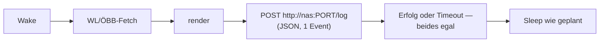
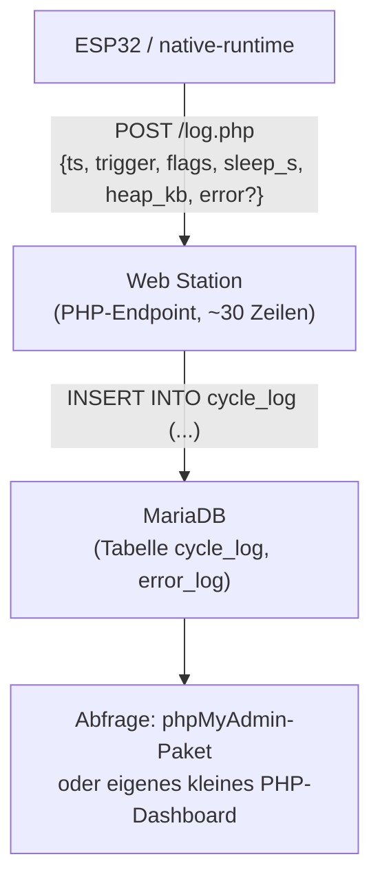

# Log-Server-Konzept: bustaferl-Traces auf der DS418j

## Ziel

Anwendungs-Events (Cycle-Ergebnis, Fehler, Sleep-Entscheidungen — nicht
HAL-Rauschen wie `_PowerOn`/`_PowerOff`) landen zentral auf der NAS statt nur
im 292-B-RTC-Ring des Geräts (`CycleTrace`, [../src/data/CycleTrace.h](../src/data/CycleTrace.h))
bzw. im flüchtigen `run.log` der Host-Soaks. Damit werden Anomalien über Tage/
Wochen sichtbar, nicht nur bis zum nächsten Reboot oder Soak-Ende.

## Randbedingungen (bereits verifiziert)

- **DS418j**: Realtek RTD1293, 2×1.4 GHz ARM64, 1 GB RAM, **kein offizielles
  Container Manager / Docker**. Community-Workarounds existieren, sind hier
  aber explizit ausgeschlossen (Wunsch: nur Bordmittel/Package-Center).
- **ESP32-Gerät**: deep-sleep-batteriebetrieben, wacht nur für Sekunden pro
  Zyklus, hält keine dauerhafte Verbindung. Bereits ein WiFi/HTTP-Fenster pro
  Zyklus vorhanden (WL/ÖBB-Fetch) — ein zusätzlicher POST reitet darauf mit.
- **Kein Log-Sink-Interface im Code.** Aktuell ad-hoc `std::snprintf` in
  `cycle_runner.cpp`/`snapshot_logger.cpp`, auf ESP32 Richtung Serial, im
  Host-Treiber (`test/test_native_runtime/`) Richtung `run.log`. Ein Sink muss
  sauber eingezogen werden, nicht als zweiter paralleler Pfad.
- **Filter „nicht alles"**: `CycleFlag`/`TraceError`
  ([../src/data/CycleTrace.h](../src/data/CycleTrace.h)) ist bereits die
  richtige Flughöhe — kompakte, strukturierte Events, kein Rohtext, keine
  Treiber-Zeile pro e-Paper-Refresh-Schritt.

## Transport: Gerät pusht direkt

Ein kleiner HTTP-POST im ohnehin offenen Wake-Fenster, **nach** dem
WL/ÖBB-Fetch und **vor** dem Sleep-Entscheid — darf den Sleep-Pfad nicht
blockieren:

**Harte Regel:** Der POST bekommt ein kurzes Timeout (z. B. 1–2 s) und wird
bei Fehlschlag verworfen, nicht retried. Das Sleep-Budget/die Batterie dürfen
nie von der Erreichbarkeit der NAS abhängen — sonst wird aus einem
Beobachtungs-Feature ein neuer Ausfallgrund für das eigentliche Produkt.
Der RTC-Ring bleibt zusätzlich bestehen (Fallback, Diagnose-Modus offline).

Der Host-Soak-Treiber bekommt denselben Sink (gleiche Event-Struktur, gleicher
Endpoint) — lange Läufe wie die 24h-Soaks landen dann automatisch mit, ohne
Sonderfall.

## NAS-Seite: nur offizielle DSM-Pakete

Zwei Bordmittel-Optionen, beide ohne Docker:

### Option A — Log Center (Syslog, sofort einsatzbereit)

DSM-Paket „Log Center" (offiziell, im Package Center). Unter
*Log Receiving* eine Regel mit UDP/TCP Port 514 anlegen. Das Gerät sendet
strukturierte Syslog-Zeilen (z. B. `CEE`/JSON-in-Message oder einfaches
`key=value`-Format).

- **Für**: null Custom-Code auf der NAS, DSM-Bordmittel, sofort startklar,
  IP-Filter für erlaubte Absender eingebaut.
- **Gegen**: Log Centers Such-/Filter-UI ist auf DSM-Systemlogs zugeschnitten,
  nicht auf eigene strukturierte Events (`CycleRecord`-Felder als Spalten
  abzufragen ist umständlich — eher grep-artig als Tabellen-Query).

### Option B — Web Station + PHP + MariaDB (strukturiert, abfragbar) — empfohlen

Drei offizielle Pakete: **Web Station**, **PHP 8.x**, **MariaDB 10**. Alle
laufen nachweislich auf ARM/1 GB-Modellen (Standard-Setup für kleine
Wordpress/Webtrees-Installationen auf genau dieser NAS-Klasse).

- **Für**: strukturierte Spalten (`trigger`, `stream0_ok`, `heap_free_kb`,
  `sleep_s`, …) statt Freitext-Grep; SQL für „zeig mir alle Zyklen mit
  `RESCUE_TRIED` letzte 30 Tage"; skaliert mit 1 GB RAM problemlos (Tabelle
  bleibt klein — ein Event alle ~30–60 s, keine Bilddaten).
  **Off-the-shelf**: exakt die Vorgabe — drei Standard-Pakete aus dem
  Package Center, kein Docker, kein Fremdscript.
- **Gegen**: ~30–50 Zeilen eigener PHP-Code für den Endpoint (Insert +
  einfache Validierung). Kein Weg drumrum, wenn es strukturiert & abfragbar
  sein soll — Log Center kann das nicht liefern, ohne dass man denselben
  Aufwand in Syslog-Parsing steckt.

**Empfehlung: Option B.** Der Mehraufwand ist ein einziger kleiner PHP-Endpoint;
dafür gibt es echte Abfragbarkeit (Trends über Wochen, „wie oft
`RleOverflow`", Heap-Drift über Zeit) statt Text-Logs zum Durchscrollen —
und es bleibt vollständig bei offiziellen DSM-Paketen.

## Event-Schema (Vorschlag, direkt aus CycleTrace.h abgeleitet)

Ein Event pro Cycle-Ende (nicht pro HAL-Aufruf):

| Feld            | Herkunft                                | Beispiel        |
|-----------------|------------------------------------------|------------------|
| `ts`            | `CycleRecord.at`                         | Unix-Epoch       |
| `trigger`       | `CycleRecord.trigger` (Timer/Button/ColdBoot) | `Timer`     |
| `stream_ok`     | `CycleFlag` Bits 0–3 dekodiert           | `[1,1,0,1]`      |
| `rendered`      | `CYC_RENDERED`                           | `true`           |
| `rescue_tried`/`rescue_ok` | `CYC_RESCUE_*`                 | `false,false`    |
| `deep_sleep`    | `CYC_DEEP_SLEEP`                         | `false`          |
| `sleep_s`       | `CycleRecord.sleep_s`                    | `30`             |
| `failed_batches`/`retried_batches` | `CycleRecord.*`        | `0,0`            |
| `heap_free_kb`  | `CycleRecord.heap_free_kb`               | `142`            |
| `error`         | nur bei Anomalie: `ErrorRecord` (code+detail) | `null` oder `{code:"HttpOgd", detail:2}` |
| `source`        | neu: unterscheidet Gerät vs. Soak-Treiber | `esp32` / `native-runtime` |

Das ist eine 1:1-Serialisierung der bestehenden Structs — kein neues
Datenmodell, nur ein neuer Sink dafür.

## Umsetzungsschritte (grob, noch nicht geplant im Detail)

1. **Log-Sink-Interface** einziehen (`ILogSink` o. ä. in `src/hal/`), analog zu
   `IPersistentStore`/`INetwork` — `logCycle(const CycleRecord&)`,
   `logError(const ErrorRecord&)`. ESP32-Implementierung macht den POST,
   Host-Implementierung schreibt zusätzlich zum bestehenden `run.log`.
2. **`cycle_runner.cpp`** ruft den Sink an der Stelle auf, wo heute
   `tracePushCycle`/`tracePushError` in den RTC-Ring schreiben — zusätzlich,
   nicht anstatt.
3. **NAS**: Web Station + PHP + MariaDB installieren, Tabelle anlegen,
   `log.php`-Endpoint schreiben (Insert + Minimal-Validierung + evtl.
   Token/IP-Whitelist, da das Gerät im Heimnetz unauthentifiziert postet).
4. **Batterie-Test**: POST-Overhead pro Zyklus messen (WiFi ist eh wach,
   zusätzliche Bytes minimal) — sollte im Rauschen des bestehenden
   WL/ÖBB-Fetches verschwinden, aber verifizieren statt annehmen.
5. **Alte Soak-Läufe** (z. B. bestehende `run.log`-Dateien) könnten
   retroaktiv geparst und nachimportiert werden, falls historischer Vergleich
   gewünscht ist — optional, kein Blocker.

## Offene Fragen für später (nicht heute entscheiden)

- Aufbewahrungsdauer / Rotation in MariaDB (z. B. 90 Tage, dann aggregieren
  oder löschen) — 1 GB RAM verträgt keine unbegrenzt wachsende Tabelle.
- Zugriffsschutz des Endpoints (Shared Secret im POST-Body reicht vermutlich,
  da Heimnetz + kein sensibler Payload).
- Ob ein kleines Grafana-artiges Dashboard gewünscht ist oder SQL-Abfragen per
  phpMyAdmin genügen (letzteres ist der pragmatischere Start).
